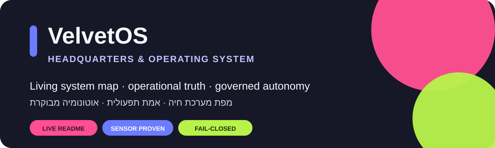

<p align="center">
  
</p>

<p align="center">
  <strong>Velvet Factory Headquarters & OS</strong><br>
  מערכת הפעלה עסקית חיה ל־Velvet Factory · A living operational OS for Velvet Factory
</p>

<p align="center">
  <a href="#עברית">עברית</a> · <a href="#english">English</a> · <a href="CHANGELOG.md">Changelog</a> · <a href="docs/START-HERE-HE.md">Start Here</a>
</p>

---

## Operational Snapshot · תמונת מצב

<!-- OPERATIONAL-SNAPSHOT:START -->
<table>
<tr>
<td align="center"><strong>22</strong><br><sub>Skills · יכולות Living Studio</sub></td>
<td align="center"><strong>39</strong><br><sub>Sensors · חיישני חוזה</sub></td>
<td align="center"><strong>7</strong><br><sub>Workflows · אוטומציות GitHub</sub></td>
<td align="center"><strong>31</strong><br><sub>Packs · חבילות מערכת</sub></td>
</tr>
</table>

> **System posture · מצב מערכת:** capability claims are evidence-based; provider-dependent actions remain gated/fail-closed unless live-verified. · הצהרות יכולת נשענות על ראיות; פעולות תלויות ספק נשארות מבוקרות/סגורות-בטוח עד אימות חי.
<!-- OPERATIONAL-SNAPSHOT:END -->

<p align="center">
  <strong>LIVE / VERIFIED</strong> · <strong>IMPLEMENTED</strong> · <strong>GATED</strong> · <strong>OPTIONAL</strong> · <strong>PLANNED</strong>
</p>

---

# עברית

## מה זה VelvetOS

VelvetOS הוא כבר לא "backend kernel" בלבד. זהו **מערך ההפעלה של המשרד והעסק**: מקורות אמת, זיכרון עסקי, Intake, ניהול עבודות, אוטומציות, Skills, חיישנים, בקרה, תוכן, מדיה, תפעול, אינטגרציות ונתיבי failover — עם הבחנה ברורה בין מה שקיים בקוד, מה מאומת חי ומה עדיין דורש אישור או ספק חיצוני.

**Tenant פעיל:** Velvet Factory · שדרות  
**ערוצים פעילים:** Instagram `@velvets_cloud` · WhatsApp `050-2517000` · איסוף עצמי בשדרות

### שלוש שכבות

| שכבה | תפקיד |
|---|---|
| **Core / Kernel** | חוקים, schemas, modules, packs, sensors וחוזי אירועים משותפים |
| **Office / Control Plane** | Intake, jobs, approvals, follow-ups, briefs, memory, content ומעקב ביצוע |
| **Edge** | ביצוע מקומי/פיזי כשצריך לגעת במכונות או runtime מקומי |

ארכיטקטורה קנונית: [`docs/VELVETOS.md`](docs/VELVETOS.md) · [`packages/velvetos/LAYERS.md`](packages/velvetos/LAYERS.md) · [`packages/velvetos/ADR-THREE-LAYERS.md`](packages/velvetos/ADR-THREE-LAYERS.md)

> **עיקרון:** מקור אמת אחד, הרבה תצוגות ואוטומציות. לא בונים מערכת מקבילה רק כי עלה רעיון חדש.

## מפת היכולות

<table>
<tr><td><strong>Office Control Plane</strong></td><td><strong>IMPLEMENTED</strong></td><td>סטטוס משרד, watchdog, gaps, follow-ups, dead-letter, handoff, review, memory hygiene ו־WIP→finished.</td></tr>
<tr><td><strong>Living Studio</strong></td><td><strong>IMPLEMENTED</strong></td><td>שכבת חיבור על מקורות האמת הקיימים עם 22 Skills תפעוליים.</td></tr>
<tr><td><strong>Universal Intake</strong></td><td><strong>IMPLEMENTED</strong></td><td>נרמול וניתוב פניות/מסמכים/פגישות/מדיה ל־handlers קיימים, בלי Inbox מקביל.</td></tr>
<tr><td><strong>Jobs + Google Sheet bridge</strong></td><td><strong>IMPLEMENTED / FAIL-CLOSED</strong></td><td>pull/push/reconcile, הגנת concurrency וללא ניחוש tab.</td></tr>
<tr><td><strong>vfmem</strong></td><td><strong>IMPLEMENTED</strong></td><td>זיכרון עסקי והקשר לפני הפיכת notes/meetings/documents למצב תפעולי.</td></tr>
<tr><td><strong>Autonomy + Risk Gates</strong></td><td><strong>IMPLEMENTED</strong></td><td>הפרדה בין פעולות בסיכון נמוך לבין פעולות שדורשות gate/approval.</td></tr>
<tr><td><strong>Instagram MCP + Insights</strong></td><td><strong>LIVE / VERIFIED</strong></td><td>נתיבי Insights נתמכים ו־CTA audit מאומתים; mutations לא נתמכים לא מוצגים כאילו הם עובדים.</td></tr>
<tr><td><strong>Media Vault + vfmedia</strong></td><td><strong>IMPLEMENTED</strong></td><td>incoming → source → WIP → approved, עם checksum ו־persist-before-move.</td></tr>
<tr><td><strong>Hebrew Copy QA</strong></td><td><strong>IMPLEMENTED</strong></td><td>עברית טבעית, anti-AI QA ושער FACT vs INVENTED.</td></tr>
<tr><td><strong>Organic Growth / Content Factory</strong></td><td><strong>IMPLEMENTED / HUMAN-GATED</strong></td><td>עבודה אמיתית → רעיונות/טיוטות/approval queue; בלי autopost ובלי auto-DM.</td></tr>
<tr><td><strong>Production Support</strong></td><td><strong>IMPLEMENTED</strong></td><td>routing, חומר, spool/slice, maintenance signals ותכנון ייצור מבוקר.</td></tr>
<tr><td><strong>Gmail Operating Brief</strong></td><td><strong>IMPLEMENTED</strong></td><td>בריף HTML עם מדיה inline ושליחה כאשר קיימים credentials תקפים.</td></tr>
<tr><td><strong>Office-manager Failover</strong></td><td><strong>OPTIONAL / GOVERNED</strong></td><td>מעבר מבוקר לכלי חלופי בלי לייצר SoT נוסף.</td></tr>
<tr><td><strong>Agents / Skills catalog</strong></td><td><strong>AVAILABLE TOOLING</strong></td><td>קטלוג specialists גדול; עצם קיום prompt/rule לא נחשב הוכחת capability פעילה.</td></tr>
<tr><td><strong>Sensors + CI</strong></td><td><strong>ACTIVE</strong></td><td>חיישני `check-*.py` ו־GitHub Actions כראיית חוזה executable.</td></tr>
</table>

## אוטומציות פעילות בריפו

- full sensor suite
- Gmail brief send
- Office Control Plane loop
- publish-bridge cleanup
- VelvetOS research
- weekly deck generation
- vfmedia intake

קובץ workflow מוכיח שהאוטומציה קיימת; פעולה חיצונית נחשבת **LIVE** רק אחרי אימות אמיתי מול provider/runtime.

## מקורות אמת

| תחום | מיקום קנוני |
|---|---|
| זהות Core | `packages/velvetos/CORE.json` |
| שכבות | `packages/velvetos/LAYERS.md` |
| Event contracts | `packages/velvetos/schema/events.catalog.json` |
| Office control | `office/control-plane.json` + `office/control/` |
| Living Studio | `packages/velvetos/living-studio/` |
| Media catalog | `packages/vfmedia/` |
| חוקי מערכת | `constitution/` |
| Sensors | `scripts/check-*.py` |
| Workflows | `.github/workflows/` |
| היסטוריית שינויים | [`CHANGELOG.md`](CHANGELOG.md) |
| הנחיות agents | [`AGENTS.md`](AGENTS.md) |

## חוקי אמת עסקית

- לא ממציאים מחירי ₪.
- לא ממציאים לקוחות, הזמנות או זמני ביצוע.
- לא טוענים שפעולת provider הצליחה בלי ראיה.
- לא ממציאים Origin slugs; אם לא ידוע — `unknown`.
- לא יוצרים source of truth מקביל בשקט.
- פרסום ותקשורת חיצונית כפופים ל־approval/capability gates.
- איסוף נשאר בשדרות כל עוד הרשומה הקנונית לא שונתה.

## README חי

ה־README הוא חלק מהמוצר. שינוי מהותי ב־`packages/`, `office/`, `scripts/`, `.github/workflows/` או `constitution/` מחייב עדכון README באותו PR, אלא אם מדובר בשינוי פנימי שאינו משנה capability.

ה־Operational Snapshot למעלה **נוצר מנתוני הריפו עצמו**. להרצה ידנית:

```bash
python3 scripts/update-readme-snapshot.py
python3 scripts/update-readme-snapshot.py --check
```

**Definition of Done:** implementation + evidence/sensor + changelog + README capability/status update.

---

# English

## What VelvetOS is

VelvetOS is no longer only a backend kernel. It is the **operating layer for the office and the business**: sources of truth, business memory, intake, job state, automations, skills, sensors, control planes, content/media pipelines, external integrations and governed failover.

**Active tenant:** Velvet Factory · Sderot  
**Active channels:** Instagram `@velvets_cloud` · WhatsApp `050-2517000` · local pickup in Sderot

### Three layers

| Layer | Role |
|---|---|
| **Core / Kernel** | Shared laws, schemas, modules, packs, sensors and event contracts |
| **Office / Control Plane** | Intake, jobs, approvals, follow-ups, briefs, memory, content and completion tracking |
| **Edge** | Local/physical execution when work must reach machines or a local runtime |

Canonical architecture: [`docs/VELVETOS.md`](docs/VELVETOS.md) · [`packages/velvetos/LAYERS.md`](packages/velvetos/LAYERS.md) · [`packages/velvetos/ADR-THREE-LAYERS.md`](packages/velvetos/ADR-THREE-LAYERS.md)

> **Principle:** one source of truth, many projections and automations. New ideas extend existing SoTs instead of creating parallel systems.

## Capability map

<table>
<tr><td><strong>Office Control Plane</strong></td><td><strong>IMPLEMENTED</strong></td><td>Status, watchdog, gaps, follow-ups, dead-letter, handoff, review, memory hygiene and WIP→finished.</td></tr>
<tr><td><strong>Living Studio</strong></td><td><strong>IMPLEMENTED</strong></td><td>Connective layer over canonical SoTs with 22 operational skills.</td></tr>
<tr><td><strong>Universal Intake</strong></td><td><strong>IMPLEMENTED</strong></td><td>Normalizes and routes inquiries, documents, meetings and media into existing handlers.</td></tr>
<tr><td><strong>Jobs + Google Sheet bridge</strong></td><td><strong>IMPLEMENTED / FAIL-CLOSED</strong></td><td>Pull/push/reconcile with concurrency guards and no guessed tab names.</td></tr>
<tr><td><strong>vfmem</strong></td><td><strong>IMPLEMENTED</strong></td><td>Business context before notes, meetings and documents become operational state.</td></tr>
<tr><td><strong>Autonomy + Risk Gates</strong></td><td><strong>IMPLEMENTED</strong></td><td>Separates low-risk execution from actions that require explicit approval.</td></tr>
<tr><td><strong>Instagram MCP + Insights</strong></td><td><strong>LIVE / VERIFIED</strong></td><td>Supported Insights reads and CTA audit are verified; unsupported mutations are not presented as working writes.</td></tr>
<tr><td><strong>Media Vault + vfmedia</strong></td><td><strong>IMPLEMENTED</strong></td><td>Incoming → source → WIP → approved with checksums and persist-before-move.</td></tr>
<tr><td><strong>Hebrew Copy QA</strong></td><td><strong>IMPLEMENTED</strong></td><td>Natural Hebrew, anti-AI QA and FACT vs INVENTED gates.</td></tr>
<tr><td><strong>Organic Growth / Content Factory</strong></td><td><strong>IMPLEMENTED / HUMAN-GATED</strong></td><td>Real work becomes drafts and approval candidates; no default autopost or auto-DM.</td></tr>
<tr><td><strong>Production Support</strong></td><td><strong>IMPLEMENTED</strong></td><td>Routing, material/spool planning and maintenance signals.</td></tr>
<tr><td><strong>Gmail Operating Brief</strong></td><td><strong>IMPLEMENTED</strong></td><td>HTML + inline media brief path when valid credentials exist.</td></tr>
<tr><td><strong>Office-manager Failover</strong></td><td><strong>OPTIONAL / GOVERNED</strong></td><td>Controlled takeover without creating another source of truth.</td></tr>
<tr><td><strong>Agents / Skills catalog</strong></td><td><strong>AVAILABLE TOOLING</strong></td><td>Large specialist catalog; a prompt/rule file alone is not proof of active capability.</td></tr>
<tr><td><strong>Sensors + CI</strong></td><td><strong>ACTIVE</strong></td><td>`check-*.py` sensors and GitHub Actions provide executable contract evidence.</td></tr>
</table>

## Operational workflows

The repository currently carries workflows for the sensor suite, Gmail brief, Office Control Plane, publish-bridge cleanup, VelvetOS research, weekly deck generation and vfmedia intake.

A workflow file proves automation exists; provider-dependent behavior is **LIVE** only after real provider/runtime verification.

## Canonical sources

| Area | Canonical location |
|---|---|
| Core identity | `packages/velvetos/CORE.json` |
| Layer model | `packages/velvetos/LAYERS.md` |
| Event contracts | `packages/velvetos/schema/events.catalog.json` |
| Office control | `office/control-plane.json` + `office/control/` |
| Living Studio | `packages/velvetos/living-studio/` |
| Media catalog | `packages/vfmedia/` |
| Constitution | `constitution/` |
| Sensors | `scripts/check-*.py` |
| Workflows | `.github/workflows/` |
| Change history | [`CHANGELOG.md`](CHANGELOG.md) |
| Agent guidance | [`AGENTS.md`](AGENTS.md) |

## Living README contract

This README is part of the product. Material capability/runtime changes must update it in the same PR.

The Operational Snapshot above is generated from repository sources:

```bash
python3 scripts/update-readme-snapshot.py
python3 scripts/update-readme-snapshot.py --check
```

**Definition of Done:** implementation + evidence/sensor + changelog + README capability/status update.

---

## Quick health check · בדיקת בריאות מהירה

```bash
python3 scripts/velvetos.py core
python3 scripts/velvetos.py modules
python3 scripts/velvetos.py instances
python3 scripts/check-all.py
python3 scripts/check-commission-isolation.py
python3 scripts/update-readme-snapshot.py --check
```

## Read next · המשך קריאה

[`CHANGELOG.md`](CHANGELOG.md) · [`AGENTS.md`](AGENTS.md) · [`docs/HARNESS.md`](docs/HARNESS.md) · [`docs/FAILOVER.md`](docs/FAILOVER.md) · [`docs/MEDIA-VAULT.md`](docs/MEDIA-VAULT.md) · [`constitution/`](constitution/) · [`packages/velvetos/`](packages/velvetos/)

---

<p align="center"><strong>If VelvetOS can really do it, the README should say so.<br>אם VelvetOS באמת יודע לעשות את זה — ה־README צריך להגיד את זה.</strong></p>
