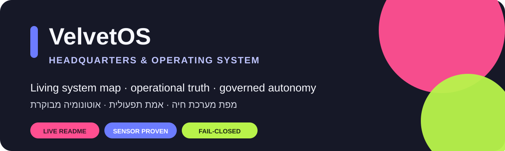

<p align="center">
  
</p>

<p align="center">
  <strong>Velvet Factory Headquarters & OS</strong><br>
  מערכת הפעלה עסקית חיה ל־Velvet Factory · A living operational OS for Velvet Factory
</p>

<p align="center">
  <a href="#hebrew">עברית</a> · <a href="#english">English</a> · <a href="CHANGELOG.md">Changelog</a> · <a href="docs/START-HERE-HE.md">Start Here</a>
</p>

---

## System Pulse · דופק המערכת

<!-- morning-green-2026-09-23 -->
Latest verified owner Morning Brief artifact path remains historical evidence. Current scheduled Instagram truth is the Cloudflare Instagram Publisher; OpenPost is frozen and must not be used as schedule authority.

**Memory backend:** `vfmem` remains canonical; Cognee `1.6.2` is integrated as an optional local/keyless derived semantic index over a curated 66-source / 13-category durable corpus. The active index uses local multilingual FastEmbed, provenance-mapped `CHUNKS`, canonical verification, deterministic vfmem fallback, and atomic `active-state.json` cutover with legacy `state.json` retained as rollback evidence. See `packages/vfmem/COGNEE.md`.

**Zero-cost stack closeout:** PR #390 is merged to `main`; the canonical final-acceptance receipt/sensor records `MERGED / merge=YES` and the reconciled suite remains **109/109 PASS**. Declared limitations remain fail-closed and unchanged.

**Reform v2 — CLOSED:** Stage 8D final acceptance is PASS. All five legacy compatibility surfaces (`sample_profile`, `root_desk`, `fleet`, `tool_status`, `chatgpt_core_bundle`) are authoritatively retired; the final semantic audit is 5/5 clear with zero blockers, all restore anchors and historical replay receipts remain Git-verifiable, exact-main `VelvetOS Core Sensors` is 116/116 green, and external-effect authority is unchanged. Canonical Velvet Factory instance surfaces remain explicit, fail-closed and authoritative; the ChatGPT distribution remains 33 files intact.

**Office v2 — PHASE 0 CLOSED ON MAIN:** PR #561 is merged at `d755c4cb62e2fde16f6c5804db180d48170238ba`; the exact-main GitHub full suite passed 117/117 after merge. Production smoke, project checkpoint→compact→verify→resume (including fail-closed negative control), correlation/provenance contracts and stateful restore admission are accepted with no new production writer. Automated Drive/Orders writes remain policy-blocked, printer/xTool live reads remain unverified with human fallback, and printer/xTool HQ commands remain prohibited.

**Office v2 — PHASE 1 CLOSED / GREEN:** the neutral LAB is realized on NODE-A with WSL 3.0.1.0, Ubuntu 26.04.1 LTS, Docker Engine 29.8.2 / Compose v5.6.0, loopback-only digest-pinned OTel, and a single hardened artifact lane at `/var/officev2/artifacts`; full Windows drive mounts remain disabled. All five START HERE criteria are PASS, the canonical suite is 118/118 PASS, PR #565 is merged at `cf040c36a3d772ffd425586bfd80f02313621360`, and exact-main Core Sensors run `37418107706` is GREEN. Routine WSL operation is headless through the hidden `OfficeV2 LAB Lease`; all temporary OfficeV2 Scheduled Tasks are removed. Production authority/writers remain unchanged. Phase 2 Inventory, Contracts & Benchmark Engineering may begin without preselecting implementation winners.

**Office v2 — PHASE 2 FOUNDATION CLOSED / BENCHMARK CONTRACTS FROZEN:** the Candidate Registry closes the full 68-item source inventory plus four explicit incumbent baselines (72 total), with lifecycle/verdict state machine, admission policy, five P0 shortlists, standard resource/cost scorecards, Pattern Adoption + research freeze/reopen contracts, and six vendor-neutral executable Golden Fixtures. The Phase 2 foundation itself promotes no challenger; lanes remain open with `winner: null` until contract-aligned benchmark evidence closes that lane.

**Office v2 — COMPETITOR-NEUTRAL REVIEW (2026-10-08):** The Constitution and Office v2 admission rules now explicitly allow complete replacement of incumbent architecture, subsystem replacement and hybrid alternatives where evidence justifies them. DeerFlow 2.0 is recorded in the existing Candidate Registry as `RESEARCHED` / `BENCHMARK_REQUIRED` / `NOT_RUN`, queued for agent-runtime and memory/context evaluation **without displacing other shortlisted candidates**. The closed original 68-source import remains intact. Legacy routine "no-second-orchestrator" locks do not bar isolated LAB comparisons; promotion, credentials, external-effect authority and recurring-cost policy remain unchanged. CI enforces the new intake/queue invariant through `check-office-v2-phase2.py`.

**Office v2 - EXISTING-TOOL WORKER FLEET COMPARISON (2026-10-08):** Existing remote Desktop Commander baseline versus Restate-only, Restate with HashiCorp Nomad CE and Windmill are now compared in a new Office v2 worker-fleet-placement lane; Kestra and Ray are queued, not rejected. Dagu 2.18.2 has now PASSED isolated real cross-host Windows/Mac worker-label routing with independent readback and moves into the active research shortlist; Selenium Grid stays queued for browser-only comparison. The real Chris Windows and MacMiniOffice.local hosts both passed the same synthetic SHA256 task with identical verified output. Production fleet promotion, mid-task worker-loss recovery, heavy concurrency and GUI execution remain UNTESTED; only the bounded Dagu two-host dispatch LAB is VERIFIED. Two more Windows PCs and at least one Mac Mini are planned, not online. See docs/implementation/office-v2/phase2/ready-made-fleet-placement-2026-10-08.md and issue #604.

**Office v2 — HISTORICAL COMPETITOR BACKFILL (2026-10-08, review-only):** A documented first-pass scan of 47 vfe2b catalog picks, 30 orchestrator entries, and 109 research links reopened OpenClaw, CrewAI, LangGraph and Ruflo for real agent-runtime benchmarks; Microsoft Agent Framework (the maintained successor to AutoGen), LobeHub and Bindu were added to the canonical candidate registry. The canonical registry now contains **86** entries while preserving all 68 original source rows and original active shortlist members. A separate pinned DeerFlow 2.x source checkout and upstream harness-boundary test passed, but no DeerFlow Golden Fixture, Docker LAB deployment or production promotion has occurred. See `docs/implementation/office-v2/phase2/competitor-neutral-backfill-2026-10-08.md` and `deerflow-v2-comparative-readiness-2026-10-08.md`; issue #595 still tracks unresolved historical links and durable new-link ingestion.

**Office v2 — PHASE 3A DURABLE EXECUTION CLOSED / RESTATE SELECTED:** the frozen 20-step destructive fixture is complete across the incumbent plus Restate, Hatchet and Temporal. Restate 1.7.12 is selected as the smallest reliable durable-execution spine; Temporal is the recorded fallback; Hatchet passed the semantic hard gate but lost on lane fit/operability; the current incumbent failed mandatory same-run recovery/resume/cancel/retry/move/replay semantics. Four normalized scorecards and `durable-execution-verdict-v0.json` record the decision. Local canonical validation is 120/120 PASS. This is an integration selection only: production authority, production writer ownership and production credentials remain unchanged.

**Office v2 — CURRENT VERIFICATION + POLICY SEMANTICS:** the sensor registry is lifecycle-aware (126 registered; 118 active `CORE+DOMAIN` regression sensors) and current office policy is event/risk driven rather than ritual-clock driven. Morning Brief and Research are manual/event-driven; the staleness sensor has no daily brief cutoff and only reports event-triggered brief presence; Best Skills is on-demand; retro is scoped to changed domains/new evidence; verified Instagram MCP is the first Insights source; routine Instagram publication may use canonical standing authorization only through exact-final gates + `policy_id: instagram.publish` + `vfigos`, never direct/bypass autopost; 3D AI providers remain fail-closed behind rights plus recurring-cost authority instead of unconditional per-use approval. These are contract semantics, not a claim that any pending PR is merged.

**Office v2 - PHASE 3B PRODUCTION READER CUTOVER PREPARED, NOT YET ACTIVE:** The canonical Morning Green Cloudflare snapshot entrypoint now selects by integrity-verified Office v2 Project State: cp016 keeps the existing incumbent GET reader; cp017 routes to the secure ZITADEL → OPA → production OpenBao `PRODUCTION_READ` resolver. A broken cp017 snapshot never falls back to CONTROL_TOKEN, unknown/tampered project state is denied, and the production resolver requires a matching promotion receipt, active binding, exact credential hash and zero writer/mutation permission. Exact post-merge CI is bound to a pinned source SHA; later `main` movement is admissible only when the SHA remains an ancestor and a protected production-reader/security path diff is empty, otherwise promotion fails closed. The two-stage cp017 activation first enters a content-hashed `ACTIVATING` state, admits only the scoped secure reader probe, and finalizes `GREEN` only after live evidence; failure restores cp016 without granting the production writer. The routing switch is effective only after explicit cp017 promotion; the code change alone grants no production authority.

**Office v2 - PHASE 3B PRODUCTION ROLLBACK / RE-ROTATION SAFETY (BRANCH GATE, NOT YET PROMOTED):** a duplicate production Rotate performs read-only live revalidation without changing Cloudflare credentials or overwriting its successful receipt; a verified rollback-to-PILOT is explicitly eligible for one fresh production rotation with the preceding receipt archived and linked by SHA-256. Failed fresh-rotation attempts are recorded separately and cannot bypass the cp016 project-state or read-only writer/mutation guards. Cloudflare rotation is accepted only after two consecutive complete proof sets: the old token returns 401, all runtime/meta-health/jobs reads return 200, and write remains 401. Transient disagreement across edge instances is retried only within the bounded verification window, then fails closed. This is a code gate, not proof of completed production promotion.

**Office v2 - PHASE 3B PILOT ACTIVE / PRODUCTION READ IMPLEMENTATION STAGED, RUNTIME PROOF PENDING:** the bounded read-only `instagram-publisher-snapshot-read` PILOT remains GREEN at Project State cp016 (`PHASE_3B_PILOT_ACTIVE`). The production authority contract is merged on main and keeps `production_promoted=false`, writer ownership unchanged and mutation forbidden. The next implementation is staged but not active: persistent production ZITADEL identity, canonical OPA principal `svc:officev2-p3b-prod-publisher-snapshot`, dedicated OpenBao broker instance `officev2-p3b-prod-openbao` on volume `officev2_p3b_prod_bao` with isolated Raft storage (`officev2-prod-node-1`), exact read path/role `officev2-prod/data/instagram-publisher-snapshot` / `officev2-prod-publisher-snapshot`, and a separate `officev2-prod-publisher-snapshot-rotator` AppRole limited to the one production secret. Initial broker bootstrap authority is one-time and revoked; subsequent credential rotation uses only the scoped rotator role. The runtime wrappers are hardened so PowerShell passes explicit WSL/Wrangler arguments without shadowing the automatic `$Args` variable, the non-secret OpenBao HCL remains readable after container privilege drop while secret material stays protected separately, and the production runtime bundle parser consumes piped JSON without stdin/heredoc collision and fails closed unless all six expected fields are present. Runtime material is DPAPI-only, rotation must prove old=401/new-read/meta/jobs=200/write=401 for two consecutive complete observations, with fail-closed provider/OpenBao restore verification on partial edge propagation, and rollback/recovery remain fail-closed. The rollback exception path restores the provider token and exact OpenBao secret only through the scoped rotator JSON payload, verifies the resulting credential hash and revoked-root proof, and records partial restoration as a distinct fail-closed diagnostic. The drill also appends its completion flag to the PowerShell JSON receipt as an explicit note property, avoiding a post-rollback bookkeeping exception. Morning Green stays on the incumbent read path until the final activation gate; the secure Office v2 adapter remains dormant until runtime proofs, exact regression, merged-main CI, a sanitized production promotion receipt and Project State cp017 all pass.

**Office v2 — CURRENT PHASE 3B PRODUCTION READ (2026-10-08):** Phase 3B advanced beyond its historical cp016/preparation notes above. Live Project State checkpoint `office-v2-phase3b-v0-cp017-production-read-active` is GREEN on exact-main commit `75410a2f2152116d1b0fbcb2524367d43055c8b7`. Production activation and subsequent Cloudflare schedule snapshot GET readback passed through ZITADEL → OPA → OpenBao for the *single* `instagram-publisher-snapshot-read` scope. Production Instagram writer authority, mutation permissions and CONTROL_TOKEN fallback remain unchanged/denied. The cp016 and pre-promotion paragraphs above are retained as historical readiness context, not current runtime state.

**Office v2 — PHASE 3C MODEL GATEWAY STARTED (contract only):** An isolated Phase 3C lane now has a vendor-neutral model routing/budget/policy/failover contract, a 13-case synthetic fixture and 7 negative controls, integrated into the existing `check-office-v2-contracts.py` sensor. The current P0 shortlist is the incumbent, LiteLLM and TensorZero, with credible additional challengers handled by competitor-neutral admission rather than automatic rejection. It **does not** install a model gateway, prove a live provider runtime, grant model-production authority or create a production writer. See `docs/implementation/office-v2/phase3c/README.md` and `scripts/vf_office_v2_model_gateway.py`.

**Office v2 — P0 MANUAL AIDER SUPERVISOR INPUT-TRUST HARDENING (2026-10-09, OFFLINE QA ONLY):** The Windows LAB supervisor now rejects a replaced Worker script or modified/untracked sibling imports BEFORE loading any Python source or starting a Job. It permits only exact Git revision 030eccbe98e5165115faa37253ad82208fc59614 and exact SHA-256 Worker/kernel-identity/continuity module pins, plus exclusive scratch/report outputs beneath the dedicated WindowsJobObjectLab root. A new model-free portable 15-case selftest covers path/overwrite/commit/untracked/import tampering. Direct Windows read-only preflight against the true existing pinned LAB source and future fresh output paths PASS; **at #639 merge time the hardened source had NOT yet been re-executed with real Aider; this historical qualification is superseded by the newer LIVE LAB evidence below**, and historical #638 live records remain explicitly tied to its original exact producer blob. No new scheduler, paid inference, broad OS sandbox or production authority. Owner #612.

**Office v2 — P0 POST-#639 LIVE WINDOWS JOB PROOF + VENV RELAY PRE-FLIGHT (2026-10-09, SYNTHETIC LAB ONLY):** The exact #639 supervisor source was *subsequently* executed in two distinct NEW Windows local Aider/Qwen3.5:9b Task Envelopes using a direct base Python interpreter: independent 3/3 visible + 12/12 hidden QA and Worker verify PASS on success; separate actual native Job close observed helper/Worker/Aider exit, retained UNKNOWN/RUNNING journal and denied blind retry on interruption. A prior VENV Python launcher created an unpinned extra PID and correctly failed closed with NO success receipt. The narrow #640 guard now rejects such Windows supervisor venv relays **before** Job creation or model/journal, without changing Aider's pinned venv binary, the Worker, or scheduler authority. Updated offline selftests 20/20 on Windows and Mac, Windows negative preflight no scratch/report, Office contracts PASS on both. Full evidence: `docs/implementation/office-v2/phase2/p0-windows-job-aider-post639-direct-python-lab-2026-10-09.json`. **P0 remains PARTIAL**: escaped descendants, autonomous recovery/failover, p50/p95/resource baselines, full two-host acceptance and production authority are NOT proven. Owner #612; placement #604.

**Office v2 — P0 TWO DISTINCT REAL MAC CODING FAMILIES, INDEPENDENT QA GREEN (2026-10-10, STILL SINGLE HOST):** A NEW `canonical-tag-v1` Task Envelope, distinct from the three older preserved failed attempts, was explicitly admitted with the opt-in byte-pinned public-only `PUBLIC_SPEC_STATE_MACHINE_V2`. Real Mac local Qwen3.5:4B/Aider modified only `canonical_tag.py` and **SUCCEEDED** in **58.344s**, original Worker `verify=PASS` with independent 3/3 visible and 12/12 hidden QA; OS birth pin, prompt and source hashes retained. Separate earlier fresh `merge-windows-v1` Task Envelope with `PUBLIC_SPEC_REMINDER_V1` also had independent 3/3+12/12 QA **PASS** (65.527s). Both records have distinct task IDs, Git bases, branches and immutable original receipts; three older failed Task Envelope journals remain byte-identical and un-retried. Phase2 `p0-two-families-mac-independent-qa-success-2026-10-10.{json,md}` pins original hashes; `vf_office_v2_p0_second_diverse_success_evidence.py` checks **25/25** adversarial cases OFFLINE with strict no-autorun/no-authority controls. **Two DIFFERENT target fixes on ONE physical Mac are not two-host fleet execution, causal prompt proof, statistically meaningful p95, production agent PR throughput, #604 distributed lease/fencing, or autonomous UNKNOWN recovery.** P0 remains PARTIAL; zero Codex/paid API/new scheduler/production writes.

**Office v2 — P0 FRESH PUBLIC-SPEC PROFILE / TWO REAL MAC QWEN QA RESULTS (2026-10-10, ONE PASS ONE FAIL):** A bounded opt-in `PUBLIC_SPEC_REMINDER_V1` profile appends only already-public task requirements to a FRESH diverse-agent Task Envelope at admission; exact-byte validation denies arbitrary prompts and mutated hidden QA, preserving historic #650 failures and the original v1 Worker. Two different fresh Git bases/Task Envelopes ran once on Mac with local Aider/Qwen3.5:4B: `merge-windows-v1` **SUCCEEDED** in 65.527s (3/3 visible + 12/12 hidden independent QA; second Worker verify PASS), while `canonical-tag-v1` **FAILED** visible+hidden QA, retained the original RUNNING journal, passed a separate failed-QA audit and has no success receipt/no retry. Both earlier #650 failed journals remained byte-identical. Phase2 `p0-two-fresh-guided-model-qa-2026-10-10.{json,md}` and offline `vf_office_v2_p0_guided_qa_evidence.py` (25/25 negative tests) pin exact evidence and explicit nonclaims. **1/2 on one host is NOT a causal A/B result, two-host success, statistically robust p95, #604 distributed lease, autonomous recovery, or production authority.** No Codex, paid API, new scheduler or customer effects; P0 PARTIAL.

**Office v2 — P0 GENERALIZED DIVERSE QWEN WORKER LAB / TWO ACTUAL MODEL QA FAILURES (2026-10-09, NEVER CLAIM GREEN):** A separate, bounded manual `scripts/vf_office_v2_p0_diverse_local_worker.py` consumes pinned PREPARED_ONLY candidates as read-only sources, then explicitly admits a *new* one-attempt local Qwen/Aider Task Envelope with its own Git checkout/branch, continuity checkpoint, fsynced exclusive RUNNING journal, native OS birth-pinned Worker+Aider IDs, fresh clone visible+hidden QA and a SUCCESS receipt **only after independent QA passes**. Original v1 `slug.py` Worker unchanged. Two actual Mac Qwen3.5:4B runs on **different** code problems produced edits but failed independent QA: interval merge visible 3/3 PASS yet hidden FAILED; canonical ID visible 1/3 and hidden FAILED. Both persisted original immutable RUNNING journals without success receipts and **were never retried or requeued**. A later read-only, separately verified failure audit checked original bytes, process birth, independent failed QA and 25/25 offline authority-negative tests, without modifying the failed tasks. Windows new `canonical_tag.py` model Task was admitted byte-exact but **NEVER executed** because CAD/Snapmaker GPU was busy. Actual source/QA/read-only failure receipts pinned in `docs/implementation/office-v2/phase2/p0-two-diverse-real-model-qa-failclosed-2026-10-09.{json,md}`. **This is a fail-closed safety/negative coding result, NOT two successful coding tasks, two coding PRs, a canonical #604 distributed lease, full orphan exclusion, autonomous recovery, or production authority.** Zero Codex/paid APIs/production effects; P0 remains PARTIAL.

**Office v2 — P0 TWO DISTINCT PHYSICAL-HOST CODING FIXTURES PREPARED (2026-10-09, NOT MODEL-RUN):** The original immutable P0 Worker remains strictly scoped to `slug.py`. A separate **preparation-only**, byte-exact catalog `scripts/vf_office_v2_p0_diverse_task_fixtures.py` now defines two nonoverlapping synthetic coding tasks with 3 visible + 12 hidden tests each, deliberate failed seeds and control solutions that PASS independent tests: Windows Chris `canonical_tag.py` (ASCII canonical identifier) and MacMiniOffice.local `windows_merge.py` (inclusive integer interval merge). Two independent host-local fresh Git repos, prompts, hidden QA and continuity checkpoints were prepared, both with original manifest/self SHA256 and independent candidate `verify` PASS; 11/11 pure offline adversarial tests on each host. Windows initial candidate was correctly blocked due to CRLF and Git slash normalization, original bytes preserved and a NEW `-b` candidate prepared with explicit byte writes. Source/host receipts pinned in `docs/implementation/office-v2/phase2/p0-two-host-diverse-prepared-fixtures-2026-10-09.{json,md}`. Both candidates declare **`PREPARED_ONLY_NOT_EXECUTABLE_BY_V1_WORKER`**, **zero model/paid API calls**, **no new scheduler/fleet/prod authority**, and **do not yet prove two actual different coding worker tasks or GitHub coding PRs**. #604 owns real fleet lease/fencing and P0 remains PARTIAL.

**Office v2 — P0 ACTUAL MAC OLLAMA INFERENCE RUNNER RSS/CPU CORRELATION (2026-10-09, NEW REAL CODING TASK):** A passive lab observer checked the original fsynced P0 Worker RUNNING journal + OS-birth-pinned Worker/Aider pair, then identified MacMini's exact native `ollama serve` PID 99094 and child `ollama runner` PID 69666 using kernel birth and the sole matching `qwen3.5:4b` digest on read-only `/api/ps`. It gathered 10 native CPU/RSS samples (process birth rechecked both before and after each metric query). **Observed** peak runner RSS **3,687,776,256 B**, serve RSS **22,429,696 B**, Ollama API-reported `size_vram` **3,953,628,688 B**; this last field is a model residency report, **NOT independently measured VRAM**. The unique fresh Task Envelope `p0-ollama-observed-mac-20261009-02` completed real local Aider inference in **43.341s**, independent original Worker `verify=PASS`, **3/3 visible + 12/12 hidden QA**. One model-warmup transient `/api/ps` timeout was tolerated only by the read-only observer within a hard bound; a previous observer-only run failed closed while its original distinct Worker independently succeeded and **was never retried**. Sanitized exact raw hashes and ten samples: `docs/implementation/office-v2/phase2/p0-mac-real-ollama-runner-correlated-resources-2026-10-09.{json,md}`; `scripts/vf_office_v2_p0_ollama_runner_resource_lab.py` has 26/26 adversarial offline selftests. No model or paid API calls in CI, process controls, client exclusivity proof, full VRAM, #604 distributed fencing, automatic recovery or production authority. P0 remains PARTIAL.

**Office v2 — P0 ACTUAL MAC MODEL WORKER + AIDER PINNED CPU/RSS LAB (2026-10-09, ONE FRESH LOCAL TASK):** A separate passive `vf_office_v2_p0_owned_worker_aider_sampler.py` observer was started **before** a newly prepared, uniquely pinned Mac Qwen3.5:4B/Aider synthetic coding Worker. It validated the original fsynced RUNNING journal and kernel process pin and independently read exact OS-birth-bound Worker/Aider RSS and CPU counters **12 times**, rechecking both native PIDs/birth identities before and after every sample. The real Worker then `SUCCEEDED` in **49.241s**, original Worker verify PASS with 3/3 visible and 12/12 hidden QA. Observed Worker RSS peak **34,930,688 B**, Aider peak **172,425,216 B**, simultaneous pair peak **207,339,520 B**, Aider cumulative CPU delta **4,949ms**. Retained raw Mac evidence and 26/26 offline adversarial checks are pinned in `docs/implementation/office-v2/phase2/p0-mac-real-worker-aider-resource-observation-2026-10-09.{json,md}`. The observer did not launch, modify or kill the Worker/model. **These two Python processes exclude Ollama inference-server resource usage and VRAM, so this is NOT full-model resource accounting, reliable peak or p95, cross-host #604 fencing, autonomous recovery, or production authority.** Zero paid API/Codex calls; P0 remains PARTIAL.

**Office v2 — P0 TWO-HOST NATIVE OWNED-CHILD CPU/RSS OBSERVER LAB (2026-10-09, NO MODEL):** A separate fresh, exclusive Python memory fixture was created on Chris Windows and MacMiniOffice.local. Each parent OS-birth-pinned the child's *exact* PID (Windows CIM / Mac psutil), sampled that same owned process's RSS/cumulative CPU SIX times with OS birth rechecks before every read, then cleanly stopped only its own child. Both live trials PASS; Windows observed peak synthetic RSS **32,198,656 bytes**, Mac **38,584,320 bytes**; **22/22** offline adversarial checks on each host. New `scripts/vf_office_v2_p0_native_resource_probe_lab.py` and pinned sanitized Phase2 `p0-two-host-owned-resource-probe-2026-10-09.{json,md}` are checked offline in Office contracts; cloud CI does **not** spawn fixture/processes. **These are proof of the measurement mechanism, NOT Aider/Ollama CPU/RAM/VRAM measurements, global orphan exclusion, #604 distributed fencing, new scheduler or production readiness.** No model/API calls, paid spend or unrelated process actions.

**Office v2 — P0 FIVE VERIFIED MAC REAL LOCAL-MODEL CODING CYCLES (2026-10-09, SAME SYNTHETIC TASK):** Five uniquely pinned Qwen3.5:4B/Ollama/Aider 0.86.2 *actual* Mac Mini Python fixes completed sequentially on five clean Git bases and Task Envelopes; all reached `SUCCEEDED`, independent original Worker `verify=PASS` with 3/3 unit + 12/12 hidden QA. Worker timings in seconds: 44.632, 47.229, 46.331, 45.228, 48.576; median **46.331s**, mean **46.399s**, exploratory nearest-rank 5-sample p95 **48.576s** (the sample maximum, **not statistically reliable**). Raw receipts/pins stay on Mac; sanitized fixed-hash evidence `docs/implementation/office-v2/phase2/p0-mac-five-real-model-sequential-metrics-2026-10-09.{json,md}`, and pure offline adversarial verifier `scripts/vf_office_v2_p0_repeat_model_evidence.py` provides 25/25 checks in Office contracts. No model calls in CI, paid APIs, Codex CLI, exact token accounting, resource time-series, cross-host throughput, autonomous recovery, canonical #604 lease or production authority. Overall P0 PARTIAL.

**Office v2 — P0 TWO-HOST LOCAL SINGLEFLIGHT / OWNED WORKER LOSS LAB (2026-10-09, SYNTHETIC ONLY):** Chris Windows and MacMiniOffice.local each ran two independent native child processes concurrently against the same *host-local* synthetic resource. Atomic filesystem `O_EXCL` admitted exactly one contender; the loser was denied, the OS-birth-pinned winner was deliberately terminated by its OWN parent, and a fresh third contender remained blocked by the untouched original reservation. Both hosts completed PASS with 25/25 offline adversarial receipt tests and separately verified raw claims. The new source `scripts/vf_office_v2_p0_local_singleflight_lab.py` and full receipt `docs/implementation/office-v2/phase2/p0-two-host-local-singleflight-loss-2026-10-09.{json,md}` are pinned and CI reruns **offline only**. **This is a real local same-host collision/loss proof on both machines — NOT cross-host distributed fencing, canonical #604 lease, automatic UNKNOWN recovery, full orphan exclusion, or authority to execute actual workers/production actions.** No model/API charges, other processes, printers or customer/social actions.

**Office v2 — P0 MANUAL NEW-ATTEMPT LINEAGE AFTER PRESERVED UNKNOWN (2026-10-09, READ-ONLY LAB):** A new pure `vf_office_v2_p0_fresh_attempt_lineage.py` verifier replayed actual historical Windows Task h (retained UNKNOWN/RUNNING journal; original bytes hashed) and wholly new Task i (distinct task ID, Git base/branch, worktree and continuity checkpoint; success remains a CLAIM to this checker until separate worker QA). It checks the canonical reconciliation of BOTH envelopes and hashes input bytes before/after without touching original tasks. 21/21 fail-closed tests reject alias/reuse, paid/Codex/production authority, journal conflicts/tamper, symlinked inputs and false success; registered in offline Office contracts. See `docs/implementation/office-v2/phase2/p0-manual-fresh-attempt-lineage-2026-10-09.{json,md}`. **Identity separation is NOT permission to run, restart, recover autonomously, mint a lease (#604), infer process/orphan absence or promote P0.** Zero model/API calls by the new checker. Owner #612.

**Office v2 — P0 DETACHED WINDOWS JOB DESCENDANT LIVE LAB (2026-10-09, SYNTHETIC ONLY):** A fresh, owned Chris Windows fixture joined a temporary parent to a native unnamed kill-on-close Job *before* the parent spawned an OS-detached grandchild using `DETACHED_PROCESS | CREATE_NEW_PROCESS_GROUP`. Native OS handles confirmed both Job memberships and process birth identities; both exited after the owned Job closed, and fresh CIM readback found neither PID. Re-sealed false-safety controls and raw hash tamper checks passed 14/14 offline. Code `scripts/vf_office_v2_p0_detached_descendant_lab.py`; pinned raw receipt and method `docs/implementation/office-v2/phase2/p0-windows-job-detached-descendant-lab-2026-10-09.{json,md}`. CI only runs offline selftests and verifies the pinned historical receipt. **This proves one observed detached grandchild, not arbitrary escaped process exclusion, automatic crash recovery, scheduler/fleet ownership (#604), production containment, or p50/p95 metrics.** Zero model or paid calls. Owner #612.

**Office v2 — P0 REAL WINDOWS JOB-SUPERVISED AIDER TWO-MODE LAB (2026-10-09):** Two DISTINCT fresh synthetic Task Envelopes on Chris Windows tested an explicitly owned, unnamed Win32 Job Object with kill-on-last-handle-close, containing a real Aider/Qwen3.5:9B process, its Worker, and the Job helper. In the interrupted trial, all three observed owned processes exited on Job close; the old RUNNING/NO_BLIND_RETRY journal survived without a false receipt and same-task retry was refused. A separately admitted new LAB task completed a real local Aider source fix in 30.172s, with 3/3 visible + 12/12 independently replayed hidden QA, and separate Worker verify=PASS. Raw pin/journal bytes, native Job receipts and full model receipt are preserved in one checked-in historical bundle with an offline adversarial verifier; existing Office CI reruns the verifier without launching any models. **Only the observed inherited Windows Job process tree is proven, not arbitrary escaped descendants, OS sandboxing, automatic failover, scheduler authority or production safety.** Manual source: scripts/vf_office_v2_p0_supervised_aider_lab.py; proof: docs/implementation/office-v2/phase2/p0-supervised-aider-windows-job-2026-10-09.{json,md}. Owner: #612; placement: #604.

**Office v2 — P0 VERIFIED OFFLINE WORKER ENVELOPE (2026-10-08, LAB only):** The infrastructure accelerator now includes a pinned headless Python fixture executor, fail-closed durable RUNNING journal, immutable-base task envelope, per-file SHA-256 worker receipt, and independent output + checkpoint verification using the existing Project State continuity engine. The same 11 offline tests pass on Chris Windows and MacMiniOffice.local; the Windows full regression passes 118/118. These checks do **not** demonstrate an autonomous LLM coding agent, zero-touch multi-host scheduling, crash recovery across workers, protected merge completion, or new production authority. No model calls or new spend occur. The next gate under issue #612 is a real zero-extra-cost noninteractive coding provider plus two genuinely independent host coding/PR/QA/recovery outcomes; #604 retains fleet scheduling ownership. See `docs/implementation/office-v2/phase2/p0-worker-offline-contract-2026-10-08.md`.

**Office v2 — P0 Git porcelain filename regression (2026-10-08, candidate on Mac):** A real Aider/Qwen local agent edit fixes `vf_office_v2_p0_worker.py` so `git()` preserves the leading `git status --porcelain` state space by removing trailing newlines only rather than stripping semantically significant leading whitespace. Two deterministic regression cases were added for tracked-unstaged and mixed tracked/untracked filenames, reaching 13/13 offline Mac worker selftests; the separate independent porcelain fixture and Office v2 contracts also pass. The change adds no model/provider/production authority. Mac full-suite execution is blocked by an absent `Pillow` dependency in the system Python 3.9 environment; protected PR CI and postmerge verification remain required. Issue: [#612](https://github.com/nocturney/velvetos-core/issues/612).

**Office v2 — P0 golden-fixture evidence integrity (2026-10-08, Windows LAB):** Aider 0.86.2 with local `qwen3.5:9b` exposed and fixed a real false-success bug: Golden Fixture receipts with present-but-null or empty required evidence were incorrectly accepted as `PASS`. The first isolated model attempt fixed only a top-level missing-object case and failed; a second clean, bounded attempt passed 4/4 independent tests. Reviewer hardening adds malformed evidence-object and raw-false rejection, deduplicated missing-key reporting, and embedded positive/negative selftests; a separate clean Windows QA clone passes 8/8 independent cases plus the selftest. This is a read-only receipt-validator change; it does not prove two-host concurrent coding, scheduler recovery, protected PR/CI/merge or extra authority until their separate gates pass. See [P0 #612](https://github.com/nocturney/velvetos-core/issues/612).

**Office v2 — P0 OPT-IN LIVE AIDER BIRTH PIN (2026-10-09, VERIFIED LAB):** The distinct model-aware Task Envelope worker supports an exact opt-in `kernel_birth_capture=REQUIRE_OS_BIRTH_BEFORE_QA_V1` set by the manual fixture preparer (`--kernel-birth-pin`), samples OS process birth identity for the actual worker and freshly spawned Aider child before independent QA, writes a journal-bound `kernel-pin.json` once, and requires independent pin readback for any opt-in `SUCCEEDED` receipt. On absent/drifting birth evidence, it **fails closed** and keeps the original no-blind-retry journal. Historical envelopes remain unmodified. **LIVE LAB VERIFIED:** Three genuine Aider/Ollama opt-in model-worker edits on Mac/Windows each passed independent fresh-Git-clone 3+12 QA and separate-process receipt verification. A distinct Mac birth-pinned Aider + worker was terminated in a dedicated LAB; its original no-blind-retry journal and OS birth pin survived with no false success; exact-task reissue was refused; a DIFFERENT manually started local-model Task Envelope passed afterward, leaving the unknown original evidence unchanged. The offline independent evidence check rejects 11 false-recovery/tamper cases. **NOT** automatic recovery, exhaustive orphan exclusion, cross-host failover, production authorization or #604 placement. See #612 and `docs/implementation/office-v2/phase2/p0-model-agent-live-birth-pin-2026-10-09.md`.

**Office v2 — P0 NATIVE PROCESS BIRTH & FAMILY HINTS (2026-10-09, LAB ONLY):** `scripts/vf_office_v2_p0_kernel_identity.py` now captures native OS process creation-time identities rather than trusting reusable PIDs alone: macOS via local psutil OS birth time plus POSIX group hints, Windows via native CIM `Win32_Process.CreationDate` with **NO** assumed Job Object. Exact synthetic parent/child captures were executed on Chris + MacMiniOffice.local, observed while alive and after natural exit; each host passed 24/24 offline contract tests. An independent offline verifier checks both readbacks and rejects eight tampered/re-sealed misleading claims; the existing Office sensor reruns both offline gates. A versioned capture requires a bound RUNNING journal, exclusive evidence lane and the original Task Envelope, and **never runs/kills/retries a model**. Existing killed Aider attempt lacks a historical OS birth pin; no retroactive ownership, exhaustive orphan proof, automatic recovery, or #604 fleet authority is claimed. See `docs/implementation/office-v2/phase2/p0-kernel-process-identity-lab-2026-10-09.{json,md}`; #612 remains P0 partial.

**Office v2 — P0 HISTORICAL AIDER PID SNAPSHOT (2026-10-09):** `scripts/vf_office_v2_p0_owner_snapshot.py` checks the bound SIGKILL historical evidence against the original local-model envelope and reads only historical PID presence. On Mac, p0-mac-kill-1 worker PID 40456 and Aider PID 40465 were absent in a 2026-10-09 observation; the original UNKNOWN journal remained present. **This is NOT proof that all descendants stopped, safe restart, ownership attestation or autonomous failover**. Read-only 16/16 offline selftests PASS on Windows and Mac and run under Office CI; zero model calls, kills, retries and production effect. Details: `docs/implementation/office-v2/phase2/p0-historical-worker-pid-snapshot-2026-10-09.md`. #612 owns the model coding, #604 owns host placement.

**Office v2 — P0 UNKNOWN JOURNAL READ-ONLY RECONCILIATION (2026-10-09):** `scripts/vf_office_v2_p0_unknown_reconcile.py` classifies local-model LAB Task Envelopes and `.running`/Worker Receipt evidence without invoking a model, retry, scheduler, network call or business effect. It checks task/host/model/base/envelope linkage, self-hash integrity, tamper/collision cases and fail-closed UNKNOWN states. **A receipt claiming SUCCEEDED is never independently verified by this classifier** and still requires the original model worker's `verify` QA/readback. The v1 RUNNING journal has no PID/start identity, so **process ownership/liveness remains UNKNOWN**, even after a crash. The existing Office sensor runs 41 offline checks. An explicit optional `verify-success` action delegates independent Git/source, model-log, continuity and fresh-clone QA replay to the original local worker on the correct host and returns `VERIFIED_TERMINAL_SUCCESS_NO_RETRY` only on complete readback. Neither mode grants a retry, new task, fleet placement or production authority. See `docs/implementation/office-v2/phase2/p0-unknown-journal-reconciler-2026-10-09.md`; #612 owns coding/reconciliation and #604 owns fleet placement.

**Office v2 — P0 WINDOWS JOB OBJECT REAL CONTAINMENT LAB (2026-10-09):** In an exclusive temporary Windows Python fixture, an unnamed native Job Object with `JOB_OBJECT_LIMIT_KILL_ON_JOB_CLOSE` was created, the fixture owner was assigned **before** it spawned a child, native `IsProcessInJob` proved both process objects belonged to that specific job, both were alive, and closing the only owned job handle caused **both processes to exit** (verified by process handles and a subsequent CIM readback). Mac independently verified the exact Windows evidence receipt, and 17/17 re-sealed false-safety negative checks passed on both hosts. Cloud CI runs only the static `selftest`/receipt `verify`; it NEVER creates a Windows Job Object or runs a model. **LAB Python fixture only**, NOT actual Aider containment, complete descendant/orphan exclusion, automatic UNKNOWN-task recovery, or fleet placement. See `docs/implementation/office-v2/phase2/p0-windows-native-job-containment-2026-10-09.{json,md}` and #612.

**Office v2 — P0 DETACHED DESCENDANT NEGATIVE / NO BLIND RECOVERY (2026-10-09):** An actual bounded Mac POSIX LAB launched an owned Python process and a child detached into a distinct session, then observed **NO_GROUP_MEMBERS_SEEN** in the original group after its owner exited while the same OS-birth-pinned detached child was STILL ALIVE. It then exited via a fixture-local stop marker; there was no model invocation, signal, production effect or live user program modification. This disproves the unsafe shortcut that an empty process group proves all orphan descendants gone. Offline 16/16 negative/overclaim assertions passed independently on Mac and Windows; the Mac receipt passed separate Windows verify. Office contracts CI now tests the pure offline verifier, not the live fixture. **Neither automatic retry nor full orphan exclusion nor Windows Job Object isolation is authorized.** See `docs/implementation/office-v2/phase2/p0-orphan-escape-negative-2026-10-09.{json,md}` and owner #612.

**Office v2 — P0 REAL LOCAL-MODEL TASK ENVELOPE & KILLED AIDER WORKER (2026-10-08):** Added a separate synthetic LAB-only `vf_office_v2_p0_local_model_worker.py` with a v1 `LOCAL_AIDER_OLLAMA_SYNTHETIC_V1` Task Envelope and honest local-model-aware Worker Receipt, instead of claiming the existing offline Python fixture invokes a model. Pinned Mac Qwen3.5:4B and Windows Qwen3.5:9B **actually produced four independently verified Aider code fixes** in clean worktrees, each with 3/3 unit + 12/12 hidden QA; three earlier non-success receipts remain preserved, including a fixed external QA import bug. On Mac an observed live Aider model-executor and its owning worker were **SIGKILLed**; the RUNNING journal survived, no false success appeared, blind retry was denied, and a *different explicitly launched new local-model Task Envelope* subsequently succeeded with separate-process verification while the original UNKNOWN journal remained untouched. Portable exclusive LAB fixture preparation, 17/17 offline contract checks and independent sealed-receipt verifier with 5 re-sealed negative controls are integrated into the existing Office contract CI. Sources: `scripts/vf_office_v2_p0_local_model_{worker,fixture,evidence}.py`; evidence/limits: `docs/implementation/office-v2/phase2/p0-local-agent-envelope-lab-2026-10-08.{json,md}`. **Synthetic `slug.py` LAB only: NO production writer, cloud API bill, Codex CLI, network sandbox guarantee, autonomous cross-host failover, scheduler authority, exact model-call count or p50/p95.** #612 owns coding; #604 owns worker placement.

**Office v2 — P0 TWO-HOST IDENTICAL-FIXTURE CODING & KILLED-WORKER LAB (2026-10-08):** Chris Windows/Qwen3.5:9B and Mac Mini/Qwen3.5:4B each made two real Aider code fixes on identical hashed Python slug fixtures (3/3 unit + 12/12 independent edge checks each, four invocations total). Single-dispatch-at-a-time wall **99.133s**, overlapping dispatch wall **51.281s** (observed **1.933×** including serial dispatch overhead; sum of model runtime versus parallel wall **1.559×**). On Mac, a separate **actual SIGKILL** of the pinned offline P0 worker preserved the RUNNING journal + partial output, omitted a false success receipt, and refused a blind rerun. After separate observation/reconciliation, a **different new isolated, locally pinned fixture task** succeeded with independent process QA while the old unknown journal remained untouched; **not** automatic model failover or autonomous resume. A second-host independent verifier validates four sealed model receipts, forced-loss receipt and four negative controls; CI's Office contracts sensor reruns it. **One paired observation only, no p50/p95 or peak resource proof; two different model sizes, no scheduler/production authority.** Local bounded fixture runner is under Phase2 labs; evidence and review: `docs/implementation/office-v2/phase2/p0-two-host-coding-bench-2026-10-08.{json,md}`. #612 owns further agent/resume; #604 owns placement.

**Office v2 — P0 AGENT CLI COMPARATIVE ADMISSION (2026-10-08):** Two noninteractive/cross-OS agent CLI candidates, OpenCode and AAIF Goose, are now queued in the existing competitor-neutral Office v2 Registry (94 candidates, retaining all 68 original imported sources and three active agent-runtime challengers). Both remain RESEARCHED / NOT_RUN / BENCHMARK_REQUIRED, with no installed executable or model execution/production authority claimed. A proven permitted zero-extra-cost model route and same-fixture coded PR/CI outcomes are still required; Codex CLI is excluded. See `docs/implementation/office-v2/phase2/p0-agent-cli-comparison-2026-10-08.md` and issue #612.

**Office v2 — P0 CROSS-CHAT ACCELERATOR TOOLS (2026-10-08, isolated LAB):** The recent owner-proposed repositories were reconciled into the single Office v2 candidate registry: Worktrunk 0.80.0 and Context Mode 1.0.169 passed bounded Windows/Mac local CLI tests (Worktrunk: worktree create/list, dirty-removal blocked and clean cleanup; Context Mode: local FTS5 index/search, no OpenCode plugin registered). Octop and NVIDIA OpenShell are documented as credible agent-team and sandbox alternatives respectively, **RESEARCH_ONLY / NOT_RUN**. Registry is 98 candidates with all 68 original sources preserved; six frozen evaluation lanes and current agent runtime shortlist are unchanged. These LAB tests neither prove a running two-host coding agent, Context Mode token savings, Octop/AgentTeams, nor OpenShell sandbox acceptance. Next: link Worktrunk to the canonical Task Envelope, measure OpenCode with/without Context Mode after real local coding baseline, compare Octop only on identical output/recovery criteria; OpenShell isolation P0.5 must not block P0. No production authority, Codex CLI or paid API was added. See `docs/implementation/office-v2/phase2/p0-recent-repo-accelerators-2026-10-08.md` and #612.

<!-- OPERATIONAL-SNAPSHOT:START -->
<table>
<tr>
<td align="center"><strong>HEALTHY</strong><br><sub><span dir="ltr">System Health</span><br><span dir="rtl">בריאות מערכת</span></sub></td>
<td align="center"><strong>4</strong><br><sub><span dir="ltr">Live / Bound Paths</span><br><span dir="rtl">נתיבים חיים / מחוברים</span></sub></td>
<td align="center"><strong>2</strong><br><sub><span dir="ltr">Gated Actions</span><br><span dir="rtl">פעולות מבוקרות</span></sub></td>
<td align="center"><strong>0</strong><br><sub><span dir="ltr">Needs Attention</span><br><span dir="rtl">דורש טיפול</span></sub></td>
</tr>
<tr>
<td align="center"><strong>23</strong><br><sub><span dir="ltr">Living Studio Skills</span><br><span dir="rtl">יכולות</span></sub></td>
<td align="center"><strong>126</strong><br><sub><span dir="ltr">Sensors</span><br><span dir="rtl">חיישנים</span></sub></td>
<td align="center"><strong>11</strong><br><sub><span dir="ltr">Workflows</span><br><span dir="rtl">אוטומציות</span></sub></td>
<td align="center"><strong>31</strong><br><sub><span dir="ltr">Packs</span><br><span dir="rtl">חבילות</span></sub></td>
</tr>
</table>

| Pulse | Current committed evidence |
|---|---|
| **Instagram MCP** | LIVE / VERIFIED |
| **Instagram Insights** | LIVE / VERIFIED |
| **Media Intake / Drive** | LIVE / VERIFIED |
| **Jobs source of truth** | Google Sheet LIVE / VERIFIED write-through |
| **Waiting work** | 1 |
| **Owner blocked** | 0 |
| **Degraded tools** | 0 |
| **Last verified / refreshed evidence** | `2026-10-09T18:25:10Z` |

<div dir="rtl"><strong>מה השתנה:</strong> Office Control Plane מוטמע · followups=1 · dead_letters=0</div>
<div dir="ltr"><strong>What changed:</strong> Office Control Plane מוטמע · followups=1 · dead_letters=0</div>

<div dir="rtl"><strong>חוזה הפולס:</strong> הבלוק מציג את הראיות האחרונות שנשמרו בריפו. הוא לא מבצע קריאת ספק חיה בזמן טעינת GitHub ולא הופך “מוגדר” ל“מאומת”.</div>
<div dir="ltr"><strong>Pulse contract:</strong> this block reports the latest evidence committed to the repository. It never performs a live provider call while rendering GitHub, and never turns “configured” into “verified”.</div>
<!-- OPERATIONAL-SNAPSHOT:END -->

<p align="center">
  <strong>LIVE / VERIFIED</strong> · <strong>IMPLEMENTED</strong> · <strong>GATED</strong> · <strong>OPTIONAL</strong> · <strong>PLANNED</strong>
</p>

---

<a id="hebrew"></a>

# ‏עברית

## ‏מה זה VelvetOS — בפשטות

‏**VelvetOS היא שכבת ניהול והפעלה לעסק שמחברת בין אנשים, AI, מידע, כלים ותהליכים — והופכת אותם למערכת אחת שיודעת להבין מה קורה, להחליט מה השלב הבא, לבצע מה שמותר לה לבצע, ולבקש אישור כשצריך.**

‏במקום שהעסק יתפזר בין שיחות, גיליונות, קבצים, אינסטגרם, תזכורות, כלי AI והרבה ידע שנשאר בראש של אנשים, VelvetOS נותנת לכל אלה מבנה משותף. פנייה יכולה להפוך לעבודה; עבודה יכולה לעבור לתכנון ייצור; תמונה מהשטח יכולה להיכנס למאגר המדיה ולהפוך לחומר לתוכן; נתוני ביצועים יכולים לחזור למערכת כלמידה; והכול נשען על מקורות אמת ברורים ועל היסטוריה שאפשר לבדוק.

‏המטרה אינה להחליף בני אדם באוטומציה עיוורת. המטרה היא **להוריד עבודה מכנית, למנוע טעויות, לשמור הקשר, לחבר בין חלקי העסק ולהשאיר החלטות רגישות בידיים הנכונות**. לכן כל כלי ויכולת מקבלים גבולות: מה מותר לבצע לבד, מה דורש אישור, מה רק מציע, ומה אסור למערכת להמציא או להניח.

### ‏איך זה עובד

‏VelvetOS פועלת כמו משרד דיגיטלי עם כמה שכבות שעובדות יחד: היא קולטת מידע ואירועים, מעדכנת מקורות אמת, בונה תמונת מצב, מפעילה Skills ו־handlers ייעודיים, מריצה חיישנים שבודקים שהחוזים נשמרים, ומייצרת תוצרים או פעולות בהתאם לרמת הסיכון. מעל הכול נמצא Control Plane שמוודא שהעבודה מתקדמת בלי ליצור מערכות כפולות ובלי לאבד את ההקשר העסקי.

‏המערכת בנויה כך ש־**אוטומציה אינה שווה סמכות מלאה**. קריאה, ניתוח, סיווג, הכנת טיוטה או סנכרון בטוח יכולים להיות אוטונומיים; מחיר, פרסום, מחיקה או פעולה בלתי הפיכה יכולים להישאר מאחורי gate. אם ספק חיצוני לא זמין או שאין הוכחה שהפעולה הצליחה, VelvetOS אמורה לדווח על זה כפי שהוא — לא להעמיד פנים שהכול עבד.

### ‏למה היא בנויה כך

- ‏**מקור אמת אחד לכל תחום** — כדי שאותו לקוח, job או asset לא יקבל כמה גרסאות סותרות.
- ‏**Evidence before confidence** — יכולת נחשבת חיה רק כשהיא מגובה בראיה, sensor או אימות provider. ב־Jobs, כתיבה נחשבת חיה רק אחרי WIF write + Sheets read-back receipt - לא רק binding. Repository persistence: only sync-receipt.json; adapter CSV files stay gitignored.
- ‏**Fail-closed במקום ניחוש** — כשלא יודעים, עוצרים או מסמנים `needs_sync` / `needs_input`; לא ממציאים.
- ‏**Human-in-the-loop איפה שיש משמעות אמיתית** — מערכת טובה חוסכת החלטות קטנות, לא גונבת החלטות גדולות.
- ‏**למידה מהעבודה עצמה** — אירועים, תוצאות, תוכן, failures ו־Insights חוזרים למערכת ומשפרים את ההחלטה הבאה.
- ‏**יכולת להתרחב בלי לבנות הכול מחדש** — ה־Core, החוקים וה־patterns נועדו לאפשר בעתיד Offices/עסקים נוספים עם זהות ותהליכים משלהם, בלי לשכפל את הליבה.

### ‏כמוצר

‏אפשר לחשוב על VelvetOS כעל **Business Operating System עם AI מובנה**: לא עוד chatbot שעונה על שאלות, ולא רק אוסף אוטומציות. זו שכבה מתמשכת שיושבת מעל כלי העסק הקיימים, זוכרת את המבנה והחוקים, מחברת בין אירועים, מפעילה מומחים לפי צורך, שומרת על גבולות סמכות ומספקת תמונת מצב אמינה לבעלים ולצוות.

‏היום המופע הפעיל הוא **Velvet Factory**, סטודיו להדפסות תלת־ממד בשדרות. הכיוון קדימה הוא מערכת שניתן יהיה להצמיד לעסקים נוספים: אותו מנוע עקרונות, בקרה ואוטומציה — עם tenant, workflows, integrations ו־policies שמתאימים לכל עסק.

‏**Tenant פעיל:** Velvet Factory · שדרות  
‏**ערוצים פעילים:** Instagram `@velvets_cloud` · WhatsApp `050-2517000` · איסוף עצמי בשדרות

## ‏המבנה הטכני בקצרה

|‏ שכבה | תפקיד |
|---|---|
|‏ **Core / Kernel** | חוקים, schemas, modules, packs, sensors וחוזי אירועים משותפים |
|‏ **Office / Control Plane** | Intake, jobs, approvals, follow-ups, briefs, memory, content ומעקב ביצוע |
|‏ **Edge** | ביצוע מקומי/פיזי כשצריך לגעת במכונות או runtime מקומי |

‏ארכיטקטורה קנונית: [`docs/VELVETOS.md`](docs/VELVETOS.md) · [`packages/velvetos/LAYERS.md`](packages/velvetos/LAYERS.md) · [`packages/velvetos/ADR-THREE-LAYERS.md`](packages/velvetos/ADR-THREE-LAYERS.md)

‏Registry ארכיטקטורת מדיניות: [`packages/velvetos/policy/README.md`](packages/velvetos/policy/README.md) — מיפוי סמכויות, סנסורים ו־retention; דוחות Stage 0 נמצאים תחת `packages/velvetos/policy/reports/`. Stage 1 מרכז את `instagram.publish` ב־evaluator יחיד ומחבר אותו ל־Cloudflare publisher לפני ה־publish mutation. Cutover חי אומת ב־27.9.2026 ב־Worker version `c4e82e25-2949-47ce-9446-4222012ff81e`; receipt מלא ב־`packages/velvetos/policy/reports/stage1-instagram-publish-cutover.json`. Stage 2A מיפה את ה־sensor registry; Stage 2B הפעיל affected-selector ב־shadow עם critical always-on קטן ו־fail-broad לשינויים לא מוכרים/רגישים, ו־Stage 3 כבר עבר ל־affected-only enforcement עבור PRs תוך שמירת fail-broad ל־active regression המלא. ראיית הפתיחה מקובעת ב־`packages/velvetos/policy/reports/stage2-shadow-observation-baseline.json` ואינה מונה חיה; `scripts/collect-sensor-shadow-observations.py` מחשב readiness חי בקריאה בלבד מתוך ראיות GitHub Actions. Stage 3 הפעיל affected CI: `packages/velvetos/policy/reports/stage3-activation-receipt.json` נקשר ל־`main` ‏`09f73c909e6583844d9ca80c192462369b13decf` ול־69 PRs / 129 runs עם 0 critical misses, history מלא ו־deterministic replay PASS. סף 7 הימים נשאר מתועד, וחריגת duration-only בהחלטת בעלים נרשמה ב־5.8467 ימים; החריגה תקפה רק כאשר זה החסם היחיד וכל יתר תנאי היציאה עוברים. ה־selector הוא `enforced`: PRs מריצים selected suite, push ל־`main` נשאר full suite, ו־unknown/broad changes נשארים `FULL_SUITE`. ה־branch ruleset ‏`23284099` פעיל כעת על `main`: מחיקה ו־non-fast-forward חסומים, `check-all` הוא בדיקת הענף המופעלת, ואין bypass actors. כדי לאפשר את בדיקת הענף `check-all` בלי bypass, כל machine writer שכותב ל־`main` עובר דרך staging SHA זמני → `workflow_dispatch` של Core Sensors → selected-suite ירוק → commit-status בשם `check-all` שנכתב רק אחרי הצלחה על אותו SHA → push של אותו SHA ל־`main`; סוג הכתיבה נגזר מה־diff האמיתי: `STATE_DATA`, `DOMAIN_ARTIFACT` ו־`CODE_CONTRACT` משתמשים בראיית ה־exact-SHA שכבר עברה לפני ה־push, בעוד `AUTHORITY_SECURITY` בלבד שולח לאחר ה־push `workflow_dispatch` נוסף עם `execution=main_full` ודורש הוכחת full-suite על ה־main החי. שינוי מקביל ב־main מבטל את ראיית ה־precheck ומכריח rebase+recheck, ללא force-push או bypass. Stage 4A מקבע baseline ללא שינוי behavior ב־`packages/velvetos/policy/reports/stage4a-friction-baseline.{json,md}`: 14 flows שגרתיים, 8/14 נופלים ל־`general_business`, 6/14 מיושרים למסלול הצפוי, ממוצע 13.29 authority sources ו־5.14 hard gates לבקשה; ה־snapshot משמש נקודת השוואה ל־Stage 4B ולא משנה שום gate. מיפוי Stage 2B כולל כעת גם `packages/vfharness/state/runtime/**` עבור `check-zero-cost-final-acceptance`, כדי ששינויי runtime receipts לא יוכלו להיכשל ב־full suite בלי להיכלל ב־shadow selection. ריצת shadow היסטורית חסרה יכולה להיחשב recovered רק באמצעות רשומת recovery שנבדקת fail-closed מול זהות ה־run, הוכחת full-suite והכשלים בלוג, וריצת `NO_MISS` מלאה מאוחרת יותר באותו PR; הריצה המקורית נשארת בהיסטוריה.

‏**Verification routing:** ה־selector מפריד כעת בין `triggered_by` (מי רץ) לבין `owns` (מי באמת מכסה את הנתיב). ה־registry כולל 124 sensors: ‏4 `CORE`, ‏112 `DOMAIN`, ‏6 `EVENT_ACCEPTANCE` ו־2 `RETIRED_RECEIPT`; ה־full active regression הוא 116 חיישני `CORE+DOMAIN`, בעוד event/history רצים רק כאשר המשטח שלהם משתנה או באבחון מפורש. `CHANGELOG.md` הוא חריג neutral מפורש שרץ עם 4 חיישני ה־core בלבד; executable/workflow/authority חדש או לא ממופה נשאר fail-broad ל־`FULL_SUITE` של כל ה־active regression. Historical Stage 4–8 receipts נשארים hash-locked ב־CORE, וה־generator replay הכבד נשמר כ־`EVENT_ACCEPTANCE` מפורש. Machine writers מסווגים מה־diff האמיתי ל־`STATE_DATA` / `DOMAIN_ARTIFACT` / `CODE_CONTRACT` / `AUTHORITY_SECURITY`; שלושת המסלולים הראשונים משתמשים ב־exact-SHA precheck הקנוני, ורק `AUTHORITY_SECURITY` דורש גם full active regression נוסף אחרי push. אין caller override, force-push או bypass.

> ‏**עיקרון:** מקור אמת אחד, הרבה תצוגות ואוטומציות. לא בונים מערכת מקבילה רק כי עלה רעיון חדש.

## ‏מפת היכולות

<table>
<tr><td><strong>Office Control Plane</strong></td><td><strong>IMPLEMENTED</strong></td><td dir="rtl" align="right">סטטוס משרד, watchdog, gaps, follow-ups, dead-letter, handoff, review, memory hygiene ו־WIP→finished. <code>office/control/HANDOFF.json</code> הוא משטח ה־handoff היחיד.</td></tr>
<tr><td><strong>VelvetOS Control API v1</strong></td><td><strong>CLOUD RUN LIVE / SITE ROUNDTRIP VERIFIED</strong></td><td dir="rtl" align="right"><code>packages/velvetos_control_api/</code> — שער HTTP לקריאה ראשונה (<code>velvetos.control.v1</code>) ל־Control Center: <code>/health</code>, <code>/v1/snapshot</code>, <code>/v1/search</code>, <code>/v1/capabilities</code>, <code>/v1/actions</code>. לא SoT / runtime / queue / Control Plane חדש. הדומיינים החיים המאומתים כרגע הם Control Plane/system, capabilities, attention/activity, jobs adapter ו־<code>integrations</code>. ענף ההרחבה מוסיף הקרנות קנוניות ל־production/content/files/agents/models עם שמירת unknown/missing ו־provenance; ההרחבה הזו אינה נחשבת LIVE עד merge + redeploy + staging roundtrip. Actions fail-closed בלי ביצוע כתיבה. Cloud Run הנוכחי הוא revision <code>velvetos-control-api-00004-dmq</code>; <code>/health</code> מחזיר 200, <code>/v1/snapshot</code> ללא app token נחסם ב־401, ו־snapshot/search דרך ה־staging הפרטי אומתו ב־200.</td></tr>
<tr><td><strong>Living Studio</strong></td><td><strong>IMPLEMENTED</strong></td><td dir="rtl" align="right">שכבת חיבור על מקורות האמת הקיימים עם 23 Skills תפעוליים.</td></tr>
<tr><td><strong>Universal Intake</strong></td><td><strong>IMPLEMENTED</strong></td><td dir="rtl" align="right">נרמול וניתוב פניות/מסמכים/פגישות/מדיה ל־handlers קיימים, בלי Inbox מקביל.</td></tr>
<tr><td><strong>Jobs + Google Sheet bridge</strong></td><td><strong>IMPLEMENTED / FAIL-CLOSED</strong></td><td dir="rtl" align="right">pull/push/reconcile, הגנת concurrency וללא ניחוש tab.</td></tr>
<tr><td><strong>vfmem + Cognee derived recall</strong></td><td><strong>IMPLEMENTED / LOCAL VERIFIED</strong></td><td dir="rtl" align="right">`vfmem` נשאר מקור הזיכרון הקנוני. Cognee 1.6.2 מוסיף אינדקס סמנטי מקומי נגזר על 66 מקורות / 13 קטגוריות עם FastEmbed רב־לשוני, CHUNKS עם provenance קנוני, fallback דטרמיניסטי ו־`active-state.json` אטומי; ה־startup כ־SYSTEM עבר doctor→sync→recall.</td></tr>
<tr><td><strong>Autonomy + Risk Gates</strong></td><td><strong>IMPLEMENTED</strong></td><td dir="rtl" align="right">הפרדה בין פעולות בסיכון נמוך לבין פעולות שדורשות gate/approval.</td></tr>
<tr><td><strong>Recurring Cost Governance</strong></td><td><strong>IMPLEMENTED / FAIL-CLOSED</strong></td><td dir="rtl" align="right">ברירת המחדל היא אפס עלות חדשה חוזרת. <code>NO_NEW_RECURRING_COST</code> מסווג local/self-hosted/existing-paid/free-tier/paid/unknown, דורש cost preflight לפני נתיבים שעלולים לחייב, וחוסם paid/unknown בלי אישור בעלים מפורש.</td></tr>
<tr><td><strong>Engineering Delivery + Agent Instruction QA</strong></td><td><strong>IMPLEMENTED</strong></td><td dir="rtl" align="right">החלטה→spec→tickets אנכיים→branch→אימות→review איכות והתאמה ל־spec→PR/CI; עריכת הוראות agents נבדקת מול מקור סמכות יחיד ו־context budget, וחסם אנושי אמיתי מצטמצם ל־wizard של פעולה אחת.</td></tr>
<tr><td><strong>Harness Execution Discipline</strong></td><td><strong>IMPLEMENTED / FAIL-CLOSED</strong></td><td dir="rtl" align="right">תוכניות עוברות preflight עם ראיות; שינויי behavior עוברים RED→GREEN→REFACTOR; ambiguity מקומי והפיך יכול safe ruling מתועד; fan-out רק בלי shared state, ו־gates/receipts לעולם לא נעקפים.</td></tr>
<tr><td><strong>VF Creative Publication Preflight</strong></td><td><strong>IMPLEMENTED / FAIL-CLOSED</strong></td><td dir="rtl" align="right">ולידטורי ה־preflight וה־publication evidence קשורים ל־Contract 6 / Revision 6.6.2. אחרי בחירת `creative_master`, finalization דטרמיניסטי דורש materialization אמיתי: קובץ מקומי + SHA-256 + receipt של exact bytes. תמונת UI/URL/task id לבדם אינם handoff, ושחזור הסצנה מחדש מ־raw source אינו נחשב materialization. רציפות 6.6.1, Product Truth ו־multi-source נשארים בתוקף. The active ChatGPT Project bundle (revision, bundle id, paths, SHA-256 pins) is resolved from `PROJECT-AUTHORITY-MANIFEST.json` → `chatgptProjectBundle` by `scripts/vf_project_bundle.py`; a revision bump is a manifest edit, guarded by `check-project-bundle.py`.</td></tr>
<tr><td><strong>Cloudflare Instagram Publisher</strong></td><td><strong>ACTIVE</strong></td><td>Primary scheduled publisher: Worker + D1 + KV + one-minute cron. Publication target is Meta Instagram Graph API; live state requires Graph read-back.</td></tr>
<tr><td><strong>Instagram MCP + Insights</strong></td><td><strong>LIVE / VERIFIED</strong></td><td dir="rtl" align="right">Instagram MCP מאומת הוא מקור ראשון ל־account/media Insights נתמכים; owner paste / Drive snapshot הם fallback בלבד למדד חסר או חסום. mutations לא נתמכים לא מוצגים כאילו הם עובדים, ומדד שלא הוחזר נשאר «אין ספירה». בדיקת קריאה בלבד מתוזמנת (<code>instagram-read-smoke.yml</code>) רצה יומית; החלק החי מדלג עד שמוגדר הסוד <code>VELVET_INSTAGRAM_MCP_BEARER_TOKEN</code>.</td></tr>
<tr><td><strong>Publish Bridge</strong></td><td><strong>IMPLEMENTED / ARCHIVE-PRESERVING</strong></td><td dir="rtl" align="right">נגזרות שאושרו לציבור בלבד עוברות דרך <code>publish-bridge/assets</code>; אחרי חלון active הן מועברות ל־<code>publish-bridge/archive</code>. הארכיון נשמר ללא הגבלת זמן, אין מחיקה אוטומטית ואין overwrite על collision.</td></tr>
<tr><td><strong>OpenPost Publishing Control Plane</strong></td><td><strong>PAUSED (PUBLISHING FROZEN) / LIVE NOT VERIFIED</strong></td><td dir="rtl" align="right">OpenPost נשמר כ־runtime/היסטוריה בלבד. הבעלים הקפיא את הפרסום דרכו ב־2026-09-26; אין לו סמכות תזמון, queue, retry, failover, monitoring או upgrade. ראיית staging v6.2.0 נשמרת, ומצב production/LIVE אינו נטען כמאומת.</td></tr>
<tr><td><strong>Instagram Delivery Approval</strong></td><td><strong>DEPLOYED / BOUNDARY VERIFIED / LIVE BLOCKED</strong></td><td dir="rtl" align="right">ה־issuer וה־mutation runtime פרוסים עם identities מופרדים; owner-invoker הצר עבר `/health` ב־HTTP 200 דרך IAMCredentials `generateIdToken` בלבד. smoke חי הנפיק receipt חתום אמיתי, ביצע atomic spend ב־GCS, נכשל במכוון לפני Graph ב־media fetch, וחסם replay כ־`already_spent`; `list_media` נשאר ללא שינוי. runtime ה־mutation נשאר ללא project-level roles; על `velvet-ig-approval-spend` החוזה מתיר רק bucket-level objectCreator + objectViewer לצורכי spend/fingerprint create ו־fingerprint get/list, ללא update/delete/admin. נתיבי deploy נעולים ל־`instamcp` / `me-west1`, ל־secrets קנוניים ול־service-level issuer IAM מדויק של owner-invoker; effective-IAM מכסה כתיבה/השמדה של secrets ונתיבי credentials של Compute/Build. bootstrap ראשון נשאר ב־0% traffic עד full isolation proof, ורק אז מקודם. לא בוצע Instagram Graph write או deploy חדש בשינוי הזה, לכן `LIVE` נשאר false.</td></tr>
<tr><td><strong>Social Intelligence + Creative Learning</strong></td><td><strong>IMPLEMENTED / EVIDENCE-GATED</strong></td><td dir="rtl" align="right">מחקר ציבורי חיצוני מנורמל ל־SocialResearchPacket ו־Reference mechanics, Content Matrix מבוסס הוכחות לפני saturation, ולמידה חוזרת מ־Instagram Insights רק אחרי ≥3 פוסטים מדודים לכל pattern; אין virality score כללי, scraping פרטי או runtime מקביל.</td></tr>
<tr><td><strong>Structured Demand Signals</strong></td><td><strong>DORMANT / NO PROVIDER</strong></td><td dir="rtl" align="right">רדום: אף provider לא מזין את המתאם, והוא אינו feed פעיל (#247 נסגר). הכלי נשאר ניתן להרצה ידנית. בתוך <code>vfresearch</code>: WebSearch/WebFetch נשארים קו ראשון; ראיות ציבוריות מובנות יכולות להתנרמל ל־DemandSignalPacket עם מקור/ספק/שאילתה/geo/חלון/metrics/series בלי להמציא missing values או demand score. אין scheduler/runtime/SoT חדש, אין auto-SKU ואין סמכות מחיר; provider חי נשאר UNPROVEN עד run אמיתי עם credentials.</td></tr>
<tr><td><strong>Media Vault + vfmedia</strong></td><td><strong>IMPLEMENTED</strong></td><td dir="rtl" align="right">incoming → source → WIP → approved → published archive, עם checksum ו־persist-before-move. שלב `05 - פורסם` שומר את הנגזרת המדויקת שפורסמה; מעבר `04→05` מותר רק אחרי Instagram `published_verified` / `liveVerified` עם media ID + permalink, והמקור נשאר ב־`02 - מקור`. Asset Truth ו־publication evidence מאומתים מול `catalog.schema.json`, ושדות/ערכים לא קנוניים נכשלים סגורה.</td></tr>
<tr><td><strong>Hebrew Copy QA</strong></td><td><strong>IMPLEMENTED / PIPELINE-BOUND</strong></td><td dir="rtl" align="right">עברית טבעית, FACT vs INVENTED ו־anti-slop שמי בתוך <code>lint_hebrew_copy()</code>; מצב detect מחזיר pattern/quote/fix בלי לנחש מחבר, וה־Visible Text Gate חוסם PASS על candidate עם finding.</td></tr>
<tr><td><strong>Organic Growth / Content Factory</strong></td><td><strong>IMPLEMENTED / POLICY-AUTHORIZED</strong></td><td dir="rtl" align="right">עבודה אמיתית → רעיונות/טיוטות/readiness; בחירה ועריכה שגרתיות יכולות להישאר office-owned. אין direct/bypass autopost ואין auto-DM: ה־exact-final artifact חייב את שערי האיכות/זכויות ואז <code>policy_id: instagram.publish</code>. Standing authorization יכול לאפשר LOW-risk routine tool publish דרך <code>vfigos</code>; בעלים נכנס רק ב־<code>REQUIRE_OWNER_APPROVAL</code>/<code>human_required</code>. Cloudflare Publisher נשאר schedule SoT ו־Google Calendar <code>אינסטגרם</code> mirror לקריאה בלבד.</td></tr>
<tr><td><strong>HyperFrames Video Backend</strong></td><td><strong>IMPLEMENTED / MAC VERIFIED / WINDOWS HOST VERIFIED</strong></td><td dir="rtl" align="right">`Mac-Office` / `sderot-mac` נשאר ה־render host המועדף עם ראיית smoke היסטורית. `Windows-Fallback` / `sderot-windows` הוא נתיב הגיבוי הקנוני דרך Remote Desktop Commander; ה־bootstrap מספק toolchain מקומי ומחייב doctor + רינדור 1080×1920 עברי אמיתי + ffprobe/SHA-256 receipt. Windows מאומת כעת כ־host_smoke_verified: המכשיר online, doctor עבר ורינדור smoke אמיתי עם receipt אומת; לכן הוא כשיר ל־first-healthy routing כאשר המק אינו זמין. אין העתקת מנויי דפדפן, אין port/tunnel נכנס ואין הורדת QA.</td></tr>
<tr><td><strong>Video Toolchain Adapters</strong></td><td><strong>IMPLEMENTED / WINDOWS+MAC VERIFIED / REMOTION FREE-LICENSE-ELIGIBLE</strong></td><td dir="rtl" align="right">שכבת Edit Intelligence בהשראת video-use עברה smoke אמיתי גם ב־Windows וגם ב־Mac עם EDL, חיתוך דטרמיניסטי, אודיו, receipt ו־boundary inspection; בדיקת ה־Mac גם סגרה regression של יצירת תיקיית output. Manim 0.21.0 עבר smoke אמיתי 1080×1920 בשתי התחנות, ו־Remotion זכאי כרגע ל־Free License לפי headcount=1; בדיקה מחדש רק ב־4+ אנשים או שינוי תנאים. 0.21.0 ו־4.0.523 נשמרים כראיות baseline היסטוריות בלבד, לא כנעילות runtime. HyperFrames נשאר ה־master compositor הקנוני. תבניות ה־Reel העשירות (`packages/vfom/hyperframes/`) עברו רינדור אימות ב־Windows עם קלטי TEST-ONLY; מלאי הכנת התוכן מ־2026-09-28 ב־`packages/vfom/jobs/` (VF-R006..R009, מועמדי printer-to-shelf ו־turntable) נשאר `needs_input` עד שיהיו masters, תנועה ואודיו אמיתיים. <strong>6.6.11:</strong> מסלול Adobe Premium Reel הוא המסלול הקנוני לבקשת תכין ריל/וידאו; HyperFrames נשאר compatibility backend דטרמיניסטי.</td></tr>
<tr><td><strong>Windows Speech Backend</strong></td><td><strong>LIVE / VERIFIED</strong></td><td dir="rtl" align="right">VoiceStudio עובד במדיניות latest-compatible עם minimum/recovery 0.5.2 ו־speech-doctor + smoke עברי כשער התאימות; ראיית 0.5.2 על `sderot-windows` נשמרת כ־known-good evidence. `omnivoice` משמש TTS עברי ו־`faster-whisper` ל־QA חוזר; smoke אמיתי עבר ב־0.93617 מול סף fail-closed של 0.90. MOSS-TTS-v1.5 נשאר ניסיוני. מיקום/כלי לא מוריד QA, וקבלות speech אינן אישור פרסום.</td></tr>
<tr><td><strong>Production Support</strong></td><td><strong>IMPLEMENTED</strong></td><td dir="rtl" align="right">routing, חומר, spool/slice, maintenance signals ותכנון ייצור מבוקר.</td></tr>
<tr><td><strong>CAD Engine Stack</strong></td><td><strong>ACTIVE / WINDOWS+MAC HOST VERIFIED</strong></td><td dir="rtl" align="right"><code>vfprod</code> מחזיק חוזה מנועי CAD אחיד תחת <code>CAD-ENGINE-REGISTRY.json</code>. אותו matrix קנוני של מדפסות עובד כעת ב־Windows וב־macOS באמצעות נרמול separators, וה־Mac עבר doctor מלא עם cadgen/build123d, CadQuery, JSCAD, OrcaSlicer וחמשת profiles. מסלול chat→Fabrication Router→Geometry IR→<code>vf_cad_stack.py build</code> אומת בפועל בעברית עם STEP/STL ו־DfAM: build123d/cadgen ראשי, CadQuery ו־JSCAD fallbacks מאומתים, Geometry IR שומר רק מידות/constraints מפורשים, ו־bounded repair מוגבל לשני ניסיונות לפני fallback. CAD/CAE Copilot נשאר Pilot MCP ו־Forgent3D Pilot ללא production routing. שום upload/start/control של מדפסות אינו מורשה.</td></tr>
<tr><td><strong>AI3D Engineering Core (Phases 0–15, bounded)</strong></td><td><strong>STAGED / BOUNDED VERIFIED / NO MACHINE CONTROL</strong></td><td dir="rtl" align="right">הרחבת <code>vfprod</code> תחת Fabrication Router הקיים בלבד: Geometry IR, חוזי ראיות ו־SHA-256, CAD מדויק, packs מכניים, mesh/reconstruction, הרכבות ו־ECAD, שרטוטים ו־SheetMetal. ב־Phase 10 אומתו FreeCAD FEM/Gmsh/CalculiX מול פתרון אנליטי ושתי רשתות; ב־Phase 11 נפרסו STEP→STL/3MF→Orca בפרופיל C5 ב־60 שכבות ללא שינוי פרופילים; ב־Phase 12 אומתו Fabex וה־FreeCAD GRBL post באופן מקומי בלבד, עם 33 בדיקות חסימה. Registry לא־סמכותי: 87 רשומות (61 PROVEN, ‏20 PROVEN_TYPED ללא שינוי; 20 CANDIDATE ו־4 BLOCKED). מעטפת השירות H2D, אופטימיזציה אוטומטית ו־CNC פיזי נשארים <strong>BLOCKED</strong>. שלבים 0–14 כבר מוזגו ל־main; Phase 15 נמצא בענף אימות בלבד ולא מאפשר הפעלה בייצור או שליטה/העלאה/הפעלה של מדפסות ומכונות. ב־Phase 14 בוצעו שש הרצות Orca נוספות, STL+3MF ל־U1/ECC2/Creator 5 Pro. ‏U1 ו־Creator 5 Pro עברו בדיקה כללית אך נשארים CANDIDATE בגלל פקודות קושחה שלא אומתו; ECC2 חסום בגלל Y=-1.2, ו־H2D בגלל Y=-0.5. לא בוצע שינוי בפרופילים או פעולה במכונה. Phase 15 מיפה סטטית פקודות שאינן מוכרות לבודק הכללי: 29 סוגים ב־U1, שישה ב־ECC2 וארבעה ב־Creator 5 Pro. זהו מיפוי ראיות בלבד ללא אישור קושחה או תנועה פיזית. חוזים ודוחות: <code>docs/implementation/ai-3d-modeling-engineering-core/README.md</code>.</td></tr>
<tr><td><strong>DCC + Adobe Desktop Integration</strong></td><td><strong>PRODUCTION VERIFIED / LATEST-COMPATIBLE</strong></td><td dir="rtl" align="right">שכבת ה־desktop hosts על Chris/Windows מאומתת עבור AutoCAD, Maya, 3ds Max, Inventor, Blender 5.2.2 LTS, ZBrush, Substance Painter/Designer ו־Illustrator; גשרי Photoshop 0.1.1 ו־Premiere 0.1.3 הם production-pass. מדיניות Adobe/DCC היא כעת <code>latest-compatible</code>: גרסת recovery baseline היא ראיית drift/שחזור בלבד ואינה allowlist, ו־<code>available</code> ניתן רק אחרי typed capability probe. After Effects 26.5 עבר את ה־CEP typed proof הקנוני (<code>app.getVersion</code> + <code>project.getActive</code>) וחזר ל־<code>available</code>; raw ExtendScript ופעולות write נשארות חסומות, וכשל probe ממשיך להיכשל סגור. מגבלת exact CEP runtime identity ההיסטורית נשארת upstream ואינה מחליפה את שער היכולת הטיפוסי. Creative Control Center המקומי משקף את אותם semantics דרך routing חי ו־Recovery baseline, ו־Repair נחסם ב־HTTP 409 כשהאפליקציה בריאה; Core שומר receipt עם hashes בלבד ואינו הופך את ה־UI המקומי למקור אמת נוסף. Blender משתמש ב־loopback port דינמי ולא ב־3102 קבוע. כל GUI host עולה דרך קיצור vendor/Start Menu רגיל דרך Explorer; אין החלשת integrity/signature ואין שינוי host binaries. Fusion ו־Cinema 4D מחוץ לסקופ. עבר גם reboot אמיתי: gateway 9765 עלה לפני login, רצף ה־desktop hosts הסתיים Result 0, ו־Photoshop התחבר אוטומטית ל־broker 47393 דרך משימת AtLogOn קנונית ללא watcher/DevTools. מצב העבודה היומיומי הוא background-only ב-login: תוכנות ה-GUI אינן עולות אוטומטית; סוכנים מפעילים host יחיד רק on-demand ובמצב hidden ללא Taskbar, בעוד הקיצורים הרגילים נשארים ללא שינוי. ראיות קנוניות: <code>packages/velvetos/policy/reports/stage6c-dcc-capability-gating.json</code>, <code>docs/DCC-ADOBE-FINAL-HANDOFF-2026-09-30.md</code>, <code>docs/evidence/dcc-adobe-final-regression-2026-09-30.json</code>, <code>docs/evidence/dcc-adobe-post-reboot-persistence-2026-09-30.json</code> ו־<code>docs/evidence/dcc-adobe-hidden-on-demand-2026-09-30.json</code>.</td></tr>
<tr><td><strong>Cua Windows Computer Use</strong></td><td><strong>BOUNDED FIXTURE VERIFIED / WINDOWS CALCULATOR ACCEPTANCE BLOCKED</strong></td><td dir="rtl" align="right">Cua Driver 0.34.0 הותקן באופן מקומי והורץ בחשבון Chris ב־Session 1 עם manifest צר, טלמטריה כבויה ואפס סמכות ייצור. בדיקת WinForms המבודדת אומתה עם קריאה חוזרת של 42; בדיקת Windows Calculator אמיתית עדיין חסומה: לאחר פעולות 6 וכפל התקבלה לעיתים ירידה של עץ הנגישות לאפס, ובהרצה אחרת כשל native click. כל תהליכי הניסוי נסגרו; אין Autostart או סמכות פעולה רגישה כיום. ניתן לפתח יכולות למדפסות, לקוחות, רכישות, פרסום והזדהות בבידוד; ביצוע באמצעות Computer Use מחייב הנחיה/אישור מפורש של הבעלים, שער הפעולה הקנוני וקידום נפרד של הספק (CAPABILITY_NOT_AUTHORITY_V1). ראיות: <code>packages/vfharness/state/cua-pilot-complete-2026-10-08.json</code> ו־<code>packages/vfharness/state/cua-pilot-2026-10-08.json</code>. UFO נשאר לא מותקן ודורש בחינת פער מהותי ונפרדת.</td></tr>
<tr><td><strong>Dashy Office Launchpad</strong></td><td><strong>READ-ONLY LOOPBACK VERIFIED / NOT A CONTROL PLANE</strong></td><td dir="rtl" align="right">Dashy 4.7.0 מוגש כנכסים סטטיים מקומיים ב־<code>http://127.0.0.1:4000</code>; GET מחזיר 200, נתיבי backend אינם זמינים ו־POST מסורב ב־405. קישורי Control API ו־Control Center קנוניים בלבד; אין API כתיבה, אין סמכות עסקית ואין מרכז בקרה שני. ראיות: <code>packages/vfharness/state/dashy-launchpad-smoke-2026-10-08.json</code> ו־<code>packages/vfharness/state/dashy-preflight-2026-10-08.json</code>.</td></tr>
<tr><td><strong>3D Expert Capability Graft</strong></td><td><strong>INTEGRATED / PROVIDER-NEUTRAL / COST-GATED</strong></td><td dir="rtl" align="right">יכולות expert פתוחות מ־<code>scenario-labs/skills</code> הוטמעו בתוך <code>vfprod</code>: staged Blender audit/review/repair, specialist planning, AI-mesh finishing ו־print-prep profile-bound. 3D AI Studio / Meshy / Tripo עוברים דרך provenance/rights ב־<code>vlicense</code> ו־<code>policy_id: cost.recurring.new</code>; עצם בחירת engine אינה approval gate. Existing-paid ללא incremental charge, או bounded envelope תקף עם meter+hard cap, יכול לפעול בלי אישור per-use חדש; paid/unknown/rights ambiguity נשארים fail-closed. <code>vf_3d.py</code> נשאר סמכות routing/readiness.</td></tr>
<tr><td><strong>Gmail Operating Brief</strong></td><td><strong>EVENT-DRIVEN / EVIDENCE-GATED</strong></td><td dir="rtl" align="right">Morning Brief אינו שעון יומי. הוא נבנה ונשלח רק כשיש הצדקה תפעולית; קובץ שנוצר אינו הוכחת מסירה, ו־Gmail/provider evidence נשאר חובה למסירה.</td></tr>
<tr><td><strong>Morning Green Owner Brief</strong></td><td><strong>EVENT-DRIVEN</strong></td><td dir="rtl" align="right">היכולת נשמרת ללא cron יומי. אמת תזמון Instagram עתידית מגיעה מ־Cloudflare Instagram Publisher; OpenPost היסטורי בלבד.</td></tr>
<tr><td><strong>Owner Scheduler</strong></td><td><strong>CHATGPT / MINIMAL</strong></td><td dir="rtl" align="right">מ־6.10.2026 ChatGPT הוא שעון הבעלים: Cognee Memory Sync פעם ביום סביב 11:30, VelvetOS Office Loop ב־18:30 ו־Runtime Receipts Refresh ב־19:15. כל 10 הרוטינות הידועות ב־Grok מושהות; Grok נשאר on-demand בלבד וללא מנהל רוטינות. מקור אמת: <code>automation/chatgpt/manifest.json</code>; readbacks היסטוריים של Grok נשמרים כראיות בלבד.</td></tr>
<tr><td><strong>Office-manager Failover</strong></td><td><strong>OPTIONAL / GOVERNED</strong></td><td dir="rtl" align="right">מעבר מבוקר לכלי חלופי בלי לייצר SoT נוסף.</td></tr>
<tr><td><strong>Agents / Skills catalog</strong></td><td><strong>AVAILABLE TOOLING</strong></td><td dir="rtl" align="right">קטלוג specialists גדול; עצם קיום prompt/rule לא נחשב הוכחת capability פעילה.</td></tr>
<tr><td><strong>Upstream / Toolchain Research</strong></td><td><strong>ON-DEMAND / READ-ONLY</strong></td><td dir="rtl" align="right">אין Research Seat יומי. מחקר וכלי upstream נבדקים כשיש שאלה קונקרטית, צורך תוכן או gate פתוח ב־Office v2. אין auto-upgrade; artifacts שומרים provenance, uncertainty ו־refresh target.</td></tr>
<tr><td><strong>Sensors + CI</strong></td><td><strong>ACTIVE</strong></td><td dir="rtl" align="right">חיישני `check-*.py` ו־GitHub Actions כראיית חוזה executable.</td></tr>
</table>

## ‏אוטומציות פעילות בריפו

- full sensor suite
- Gmail brief send
- ‏Office Control Plane loop (כולל רישום מועמדי למידה מכשלי CI ב־main דרך `vf_learning.py ingest-ci`)
- publish-bridge cleanup
- ‏VelvetOS research (מתקין את אותו runtime של חיישנים כמו full sensor suite לפני הרצת check-all)
- weekly deck generation
- vfmedia intake

External scheduled office clock: **ChatGPT automations** per `automation/chatgpt/manifest.json`; `automation/grok/manifest.json` is a zero-routine retirement mirror and Grok is on-demand only. GitHub workflows above remain the deterministic machine execution layer.

‏קובץ workflow מוכיח שהאוטומציה קיימת; פעולה חיצונית נחשבת **LIVE** רק אחרי אימות אמיתי מול provider/runtime.

## ‏מקורות אמת

|‏ תחום | מיקום קנוני |
|---|---|
|‏ זהות Core | `packages/velvetos/CORE.json` |
|‏ שכבות | `packages/velvetos/LAYERS.md` |
| Event contracts | `packages/velvetos/schema/events.catalog.json` |
| Office control | `office/control-plane.json` + `office/control/` |
| Control API (projection) | `packages/velvetos_control_api/` — HTTP projection gateway, not a SoT |
| Living Studio | `packages/velvetos/living-studio/` |
| Media catalog | `packages/vfmedia/` |
|‏ קישורי השראה שבועיים | `packages/vfresearch/LINKS.json` + `packages/vfresearch/sources/YYYY-MM-DD-weekly-links.md` |
|‏ Best Skills לפי צורך | `packages/vfresearch/BEST-SKILLS.json` + `TIMER.md` — `cadence=on-demand`; גיל `lastPass` הוא provenance בלבד ואינו יוצר due/stale task. הרצה נעשית רק לצורך מחקר/אימוץ/תוכן קונקרטי או gate פתוח; timer standing retired ב־2026-10-06. |
|‏ חוקי מערכת | `constitution/` |
| Sensors | `scripts/check-*.py` · CI runtime: hashed locks `requirements-sensors.py311.lock` / `.py312.lock` (from `requirements-sensors.txt`) |
| Workflows | `.github/workflows/` |
|‏ היסטוריית שינויים | [`CHANGELOG.md`](CHANGELOG.md) |
|‏ הנחיות agents | [`AGENTS.md`](AGENTS.md) |

## ‏חוקי אמת עסקית

- ‏לא ממציאים מחירי ₪.
- ‏לא ממציאים לקוחות, הזמנות או זמני ביצוע.
- ‏לא טוענים שפעולת provider הצליחה בלי ראיה.
- ‏לא ממציאים Origin slugs; אם לא ידוע — `unknown` ([`docs/ORIGIN-SLUGS.md`](docs/ORIGIN-SLUGS.md)).
- ‏לא יוצרים source of truth מקביל בשקט.
- ‏פרסום ותקשורת חיצונית כפופים ל־approval/capability gates.
- ‏איסוף נשאר בשדרות כל עוד הרשומה הקנונית לא שונתה.

## ‏README + System Pulse

‏ה־README הוא חלק מהמוצר. שינוי מהותי ב־`packages/`, `office/`, `scripts/`, `.github/workflows/` או `constitution/` מחייב עדכון README באותו PR, אלא אם מדובר בשינוי פנימי שאינו משנה capability.

‏פלט שגרתי פטור: תוצרי מחקר מתוארכים, checkpoints, תוצרי בריף, קבצי `data/`/`state/` של חבילות וראיות של workflows לא מחייבים עדכון README. קוד, קונפיגורציה וחוזים עדיין מחייבים. הרשימה המדויקת ב־`scripts/readme_contract.py`. ב־CI החיישנים רצים גם אם שלב README נכשל.

‏ה־System Pulse למעלה **נוצר מנתוני הריפו עצמו**. Workflow הרענון מופעל רק ידנית או כשמקורות הראיה שמזינים את ה־snapshot משתנים; אין cron שעתי ואין שרשרת self-commit מכל שינוי workflow/CHANGELOG. להרצה ידנית:

```bash
python3 scripts/update-readme-snapshot.py
python3 scripts/update-readme-snapshot.py --check
```

**Definition of Done:** implementation + evidence/sensor + changelog + README capability/status update.

---

<a id="english"></a>

# English

## What VelvetOS is — in plain language

**VelvetOS is a business operating layer that connects people, AI, information, tools and workflows into one system that can understand what is happening, determine the next step, execute what it is allowed to execute, and ask for approval when human judgment matters.**

Instead of letting the business fragment across chats, spreadsheets, files, Instagram, reminders, AI tools and knowledge trapped in people's heads, VelvetOS gives those parts a shared operating model. An inquiry can become a job; a job can move into production planning; media from real work can enter the media vault and become content material; performance data can return as learning; and every important transition can remain tied to a canonical source and auditable evidence.

The goal is not blind automation or replacing people. It is to **remove mechanical work, reduce mistakes, preserve context, connect the business end-to-end and keep consequential decisions with the right person**. Every capability therefore has an authority boundary: what can run autonomously, what requires approval, what may only recommend, and what the system is never allowed to invent or assume.

### How it works

VelvetOS behaves like a digital office made of cooperating layers. It ingests information and events, updates canonical sources, builds an operational picture, routes work to specialized skills and handlers, runs sensors that verify contracts, and produces outputs or actions according to risk. A Control Plane sits across those workflows so new automation extends the existing operating model instead of creating disconnected mini-systems.

The system deliberately separates **automation from authority**. Reading, classification, analysis, safe synchronization and draft generation can be autonomous; pricing, publishing, deletion or irreversible actions can remain gated. When a provider is unavailable or success cannot be proven, VelvetOS is expected to say so rather than report fictional completion.

### Why it is designed this way

- **One canonical source per domain** — customers, jobs and assets should not develop competing versions of truth.
- **Evidence before confidence** — a capability is treated as live only when backed by a sensor, receipt or provider verification. For Jobs, write-through is live only after WIF write + Sheets read-back receipt - not merely a Sheet binding. Repository persistence: only sync-receipt.json; adapter CSV files stay gitignored.
- **Fail closed instead of guessing** — unknown state becomes `needs_sync` / `needs_input`, not fabricated certainty.
- **Human-in-the-loop where consequences matter** — remove repetitive decisions without stealing important ones.
- **Learn from real work** — outcomes, failures, content performance and operational signals feed the next decision.
- **Scale without rebuilding the system** — Core laws and patterns are intended to support additional business Offices with their own instance identities, workflows, integrations and business bindings.

### As a product

VelvetOS can be understood as a **Business Operating System with AI built into the operating model**. It is not merely a chatbot and not merely a collection of automations. It is a persistent layer above the tools a business already uses: it understands the structure and rules, connects events across systems, invokes specialists when needed, preserves authority boundaries and gives owners and teams a reliable operational picture.

The active deployment today is **Velvet Factory**, a 3D-printing studio in Sderot. The direction forward is a reusable operating layer that can support additional businesses: the same Core principles, governance and automation patterns, with each business receiving its own instance identity, workflows, integrations and business bindings; Core policy authority remains shared.

**Active instance:** Velvet Factory · Sderot
**Active channels:** Instagram `@velvets_cloud` · WhatsApp `050-2517000` · local pickup in Sderot

## Technical shape at a glance

| Layer | Role |
|---|---|
| **Core / Kernel** | Shared laws, schemas, modules, packs, sensors and event contracts |
| **Office / Control Plane** | Intake, jobs, approvals, follow-ups, briefs, memory, content and completion tracking |
| **Edge** | Local/physical execution when work must reach machines or a local runtime |

Canonical architecture: [`docs/VELVETOS.md`](docs/VELVETOS.md) · [`packages/velvetos/LAYERS.md`](packages/velvetos/LAYERS.md) · [`packages/velvetos/ADR-THREE-LAYERS.md`](packages/velvetos/ADR-THREE-LAYERS.md)

Policy architecture registry: [`packages/velvetos/policy/README.md`](packages/velvetos/policy/README.md) — authority, sensor and retention mapping; Stage 0 reports live under `packages/velvetos/policy/reports/`. Stage 1 centralizes `instagram.publish` in one evaluator and wires it into the Cloudflare publisher before the publish mutation. Live cutover was verified on September 27, 2026 at Worker version `c4e82e25-2949-47ce-9446-4222012ff81e`; the receipt is `packages/velvetos/policy/reports/stage1-instagram-publish-cutover.json`. Stage 2A mapped the sensor registry; Stage 2B runs the affected selector in shadow only, with a small critical always-on set and fail-broad behavior for unknown or sensitive changes. The full suite remains the merge authority; affected-only enforcement is not active. Opening evidence is pinned in `packages/velvetos/policy/reports/stage2-shadow-observation-baseline.json` and is not a live counter; `scripts/collect-sensor-shadow-observations.py` provides a read-only live readiness calculation from GitHub Actions evidence, counts each PR once while retaining all of its historical runs, and reads reviewed miss classifications from `packages/velvetos/policy/reports/stage2-shadow-miss-classifications.json`. Stage 3 is now cutting over to affected CI: `packages/velvetos/policy/reports/stage3-activation-receipt.json` is bound to `main` `09f73c909e6583844d9ca80c192462369b13decf` and 69 PRs / 129 runs with zero critical misses, complete run history and deterministic replay PASS. The fixed 7-day threshold remains documented, and a duration-only owner exception was recorded at 5.8467 days; it is valid only when that is the sole blocker and every other exit invariant passes. The selector is `enforced`: pull requests run the selected suite, pushes to `main` retain the full suite, and unknown/broad changes remain `FULL_SUITE`. Branch ruleset `23284099` is now active on `main`: deletion and non-fast-forward are blocked, `check-all` is the enforced branch check, and there are no bypass actors. To support the `check-all` branch check without a bypass, every machine writer that targets `main` now stages an exact temporary SHA, dispatches Core Sensors against that SHA, requires the selected suite to pass, receives a `check-all` commit status only after that success, and only then pushes the same SHA to `main`; after a machine push it explicitly dispatches Core Sensors with `execution=main_full` and requires proof of the full suite on live main because `GITHUB_TOKEN` pushes do not reliably emit a new push-triggered workflow. A concurrent main advance invalidates the precheck evidence and forces rebase + recheck, with no force push or bypass. Stage 4A now pins a no-behavior-change baseline at `packages/velvetos/policy/reports/stage4a-friction-baseline.{json,md}`: 14 routine flows, 8/14 falling back to `general_business`, 6/14 aligned to the expected route, with mean burden of 13.29 authority sources and 5.14 hard gates per request. The snapshot is the comparison point for Stage 4B and changes no gate. Stage 2B mapping now also binds `packages/vfharness/state/runtime/**` to `check-zero-cost-final-acceptance`, preventing runtime-receipt changes from failing the full suite while being omitted from shadow selection. Incomplete historical shadow runs can only be cleared through a reviewed recovery record whose run identity, full-suite log evidence, recorded failures and later same-PR `NO_MISS` verification all validate fail-closed; the historical run is retained.

> **Principle:** one source of truth, many projections and automations. New ideas extend existing SoTs instead of creating parallel systems.

## Capability map

<table>
<tr><td><strong>Office Control Plane</strong></td><td><strong>IMPLEMENTED</strong></td><td>Status, watchdog, gaps, follow-ups, dead-letter, handoff, review, memory hygiene and WIP→finished. <code>office/control/HANDOFF.json</code> is the single handoff surface.</td></tr>
<tr><td><strong>VelvetOS Control API v1</strong></td><td><strong>CLOUD RUN LIVE / SITE ROUNDTRIP VERIFIED</strong></td><td><code>packages/velvetos_control_api/</code> — read-first HTTP projection gateway (<code>velvetos.control.v1</code>) for the VelvetOS Control Center: <code>/health</code>, <code>/v1/snapshot</code>, <code>/v1/search</code>, <code>/v1/capabilities</code>, <code>/v1/actions</code>. Not a new SoT, runtime, queue, or Control Plane. Currently verified live domains are Control Plane/system, capabilities, attention/activity, jobs and <code>integrations</code>. The expansion branch adds canonical projections for production/content/files/agents/models while preserving unknown/missing values and provenance; those additions are not claimed LIVE until merge, redeploy and staging roundtrip verification. Actions stay fail-closed with no write execution claimed. Current Cloud Run revision is <code>velvetos-control-api-00004-dmq</code>; <code>/health</code> returns 200, unauthenticated <code>/v1/snapshot</code> returns 401, and authenticated staging snapshot/search roundtrips are verified at 200.</td></tr>
<tr><td><strong>Living Studio</strong></td><td><strong>IMPLEMENTED</strong></td><td>Connective layer over canonical SoTs with 23 operational skills.</td></tr>
<tr><td><strong>Universal Intake</strong></td><td><strong>IMPLEMENTED</strong></td><td>Normalizes and routes inquiries, documents, meetings and media into existing handlers.</td></tr>
<tr><td><strong>Jobs + Google Sheet bridge</strong></td><td><strong>IMPLEMENTED / FAIL-CLOSED</strong></td><td>Pull/push/reconcile with concurrency guards and no guessed tab names.</td></tr>
<tr><td><strong>vfmem + Cognee derived recall</strong></td><td><strong>IMPLEMENTED / LOCAL VERIFIED</strong></td><td>`vfmem` remains canonical memory. Cognee 1.6.2 adds a local derived semantic index over 66 sources / 13 categories with multilingual FastEmbed, provenance-mapped CHUNKS, deterministic fallback and atomic `active-state.json`; the Windows SYSTEM startup path passed doctor→sync→recall.</td></tr>
<tr><td><strong>Autonomy + Risk Gates</strong></td><td><strong>IMPLEMENTED</strong></td><td>Separates low-risk execution from actions that require explicit approval.</td></tr>
<tr><td><strong>Recurring Cost Governance</strong></td><td><strong>IMPLEMENTED / FAIL-CLOSED</strong></td><td>Default target is zero new recurring cost. <code>NO_NEW_RECURRING_COST</code> classifies local/self-hosted/existing-paid/free-tier/paid/unknown routes, requires cost preflight before billing-capable use, and blocks paid/unknown paths without explicit owner approval.</td></tr>
<tr><td><strong>Engineering Delivery + Agent Instruction QA</strong></td><td><strong>IMPLEMENTED</strong></td><td>Decision→spec→vertical tickets→branch→proof→quality + spec-compliance review→PR/CI; agent instructions are checked for single authority and context cost, and genuine human-only blockers become one bounded wizard step.</td></tr>
<tr><td><strong>Harness Execution Discipline</strong></td><td><strong>IMPLEMENTED / FAIL-CLOSED</strong></td><td>Plans use evidence-bearing preflight; executable behavior follows RED→GREEN→REFACTOR; local reversible ambiguity may use a recorded safe ruling; fan-out requires independent state, and gates/receipts are never overridden.</td></tr>
<tr><td><strong>Instagram MCP + Insights</strong></td><td><strong>LIVE / VERIFIED</strong></td><td>Verified Instagram MCP is the first source for supported account/media Insights; owner paste or Drive snapshots are fallback only for unavailable metrics. Unsupported mutations are not presented as working writes and missing metrics remain unknown rather than zero. A scheduled read-only smoke (<code>instagram-read-smoke.yml</code>) runs daily; its live part skips until repo secret <code>VELVET_INSTAGRAM_MCP_BEARER_TOKEN</code> is set.</td></tr>
<tr><td><strong>Publish Bridge</strong></td><td><strong>IMPLEMENTED / ARCHIVE-PRESERVING</strong></td><td>Only public-release-approved derivatives enter <code>publish-bridge/assets</code>; after the active window they move to <code>publish-bridge/archive</code>. Archive retention is unlimited by default, with no automatic deletion and no overwrite on collision.</td></tr>
<tr><td><strong>OpenPost Publishing Control Plane</strong></td><td><strong>PAUSED (PUBLISHING FROZEN) / LIVE NOT VERIFIED</strong></td><td>OpenPost is retained as historical/runtime evidence only. Owner-frozen on 2026-09-26; no new schedules, queue, retry, failover, monitoring, or upgrade work may route through it. Staging v6.2.0 evidence is retained; production/LIVE status is not treated as verified.</td></tr>
<tr><td><strong>Instagram Delivery Approval</strong></td><td><strong>DEPLOYED / BOUNDARY VERIFIED / LIVE BLOCKED</strong></td><td>Issuer and mutation runtime are deployed with separated identities; the narrow owner-invoker `/health` path returns HTTP 200 via IAMCredentials `generateIdToken` without broad TokenCreator. A live boundary smoke issued a real signed receipt, atomically spent it in GCS, intentionally failed before Graph on private media fetch, and rejected replay as `already_spent`; canonical `list_media` stayed unchanged. The mutation runtime keeps no project-level roles; on `velvet-ig-approval-spend` the contract permits only bucket-level objectCreator + objectViewer for spend/fingerprint create and fingerprint get/list, with no update/delete/admin role. Deploy paths are pinned to `instamcp` / `me-west1`, canonical secrets, and exact owner-invoker service-level issuer IAM; effective-IAM probes cover destructive secret writes and Compute/Build credential paths. A first bootstrap stays at 0% traffic until the full isolation proof passes, then promotes the proven revision. This change performs no new deploy or Instagram Graph write, so `LIVE` remains false.</td></tr>
<tr><td><strong>Social Intelligence + Creative Learning</strong></td><td><strong>IMPLEMENTED / EVIDENCE-GATED</strong></td><td>Public external research is normalized into SocialResearchPacket/reference mechanics, proof-bound Content Matrix candidates run before saturation, and measured Instagram learning only promotes a pattern after ≥3 posts; no generic virality score, private scraping, or parallel runtime.</td></tr>
<tr><td><strong>Structured Demand Signals</strong></td><td><strong>DORMANT / NO PROVIDER</strong></td><td>Dormant: no provider feeds the adapter and it is not an active feed (#247 closed). It stays runnable for a manual call. Inside <code>vfresearch</code>: WebSearch/WebFetch remain first-line; structured public evidence can normalize into DemandSignalPacket with source/provider/query/geo/window/metrics/series while preserving missing values and forbidding synthetic demand scores. No new scheduler/runtime/SoT, no automatic SKU promotion, and no pricing authority; live provider execution remains UNPROVEN until a real credentialed run.</td></tr>
<tr><td><strong>Media Vault + vfmedia</strong></td><td><strong>IMPLEMENTED</strong></td><td>Incoming → source → WIP → approved with checksums and persist-before-move; optional Asset Truth is validated against `catalog.schema.json`, while non-canonical fields or values fail closed.</td></tr>
<tr><td><strong>Hebrew Copy QA</strong></td><td><strong>IMPLEMENTED</strong></td><td>Natural Hebrew, anti-AI QA and FACT vs INVENTED gates.</td></tr>
<tr><td><strong>Organic Growth / Content Factory</strong></td><td><strong>IMPLEMENTED / POLICY-AUTHORIZED</strong></td><td>Real work becomes drafts/readiness; routine creative selection and repair may remain office-owned. There is no direct/bypass autopost and no auto-DM: the exact-final artifact must pass quality/rights gates and <code>policy_id: instagram.publish</code>. Valid standing authorization may allow low-risk routine tool publication through <code>vfigos</code>; owner review is only synthesized for <code>REQUIRE_OWNER_APPROVAL</code>/<code>human_required</code>. Cloudflare Publisher remains schedule SoT and Google Calendar <code>אינסטגרם</code> is a read-only mirror.</td></tr>
<tr><td><strong>HyperFrames Video Backend</strong></td><td><strong>IMPLEMENTED / MAC VERIFIED / WINDOWS HOST VERIFIED</strong></td><td>`Mac-Office` / `sderot-mac` remains the preferred render host with historical smoke evidence. `Windows-Fallback` / `sderot-windows` is the canonical backup through Remote Desktop Commander; its bootstrap provisions a local toolchain and requires doctor + a real 1080x1920 deterministic Hebrew render + ffprobe/SHA-256 receipt. Windows is now host_smoke_verified: the physical device is online, doctor passed and a real smoke render with receipt was verified, so it is eligible for first-healthy routing when the Mac is unavailable. No browser-subscription credential migration, inbound port/tunnel or QA relaxation.</td></tr>
<tr><td><strong>Video Toolchain Adapters</strong></td><td><strong>IMPLEMENTED / WINDOWS+MAC VERIFIED / REMOTION FREE-LICENSE-ELIGIBLE</strong></td><td>video-use patterns power deterministic Edit Intelligence with real Windows and Mac EDL/base-cut/audio/receipt/boundary-inspection smokes; the Mac run also closed an output-directory creation regression. Manim 0.21.0 passed real 1080x1920 smoke on both hosts, while Remotion is currently Free License eligible at headcount=1; re-check only at 4+ relevant people or upstream license change. 0.21.0 and 4.0.523 are retained only as reviewed/historical baselines, not runtime locks. HyperFrames remains available as the deterministic compatibility compositor. Rich Reel templates (`packages/vfom/hyperframes/`) passed a Windows validation render with TEST-ONLY inputs; the 2026-09-28 content-prep inventory in `packages/vfom/jobs/` (VF-R006..R009, printer-to-shelf and turntable candidates) stays `needs_input` until real masters, motion and audio exist. <strong>6.6.11:</strong> Adobe Premium Reel is the canonical path for the ChatGPT Project reel/video trigger; HyperFrames remains a deterministic compatibility backend.</td></tr>
<tr><td><strong>Windows Speech Backend</strong></td><td><strong>LIVE / VERIFIED</strong></td><td>VoiceStudio uses a latest-compatible policy with minimum/recovery 0.5.2 and speech-doctor + real Hebrew TTS/STT smoke as the compatibility gate. The 0.5.2 `sderot-windows` run remains known-good evidence; `omnivoice` + `faster-whisper` QA passed at 0.93617 against the fail-closed 0.90 threshold. Host/tool routing does not lower QA, and speech receipts do not authorize publishing.</td></tr>
<tr><td><strong>Production Support</strong></td><td><strong>IMPLEMENTED</strong></td><td>Routing, material/spool planning and maintenance signals.</td></tr>
<tr><td><strong>3D AI Provider Routing</strong></td><td><strong>RIGHTS + COST GATED</strong></td><td>3D AI Studio / Meshy / Tripo route through provenance/rights via <code>vlicense</code> and <code>policy_id: cost.recurring.new</code>. Provider choice alone is not a per-use owner gate: an existing-paid route proven to have no incremental charge, or a valid bounded cost envelope with current meter + hard cap, may proceed; paid/unknown cost or rights ambiguity stays fail-closed.</td></tr>
<tr><td><strong>Fabrication Router + CAD Engine Stack</strong></td><td><strong>ACTIVE / WINDOWS+MAC HOST VERIFIED</strong></td><td>`vfprod` keeps `FABRICATION-ROUTER.md` as the single fabrication authority. The canonical printer matrix now resolves on both Windows and macOS without a second host-specific matrix; the Mac passed cadgen/build123d, CadQuery, JSCAD, OrcaSlicer and all five printer-profile checks. The chat build path is now host-verified end to end: natural-language routing → explicit Geometry IR → `vf_cad_stack.py build --engine auto` → STEP/STL → DfAM evidence. Auto selected build123d; CadQuery and JSCAD were also cross-engine verified on the same boolean model with matching 40×30×10 mm bounds, watertight single-body meshes and &lt;0.01% volume delta. Unsupported generic geometry fails closed to the existing CAD skill/code-generation path. The printer matrix remains authoritative and all printer upload/start/control remains excluded.</td></tr>
<tr><td><strong>AI3D Engineering Core (Phases 0–15, bounded)</strong></td><td><strong>STAGED / BOUNDED VERIFIED / NO MACHINE CONTROL</strong></td><td>Extends only the existing Fabrication Router authority: explicit Geometry IR and artifact receipts, exact CAD/mechanical packs, mesh/reconstruction, assembly/ECAD, technical drawings and SheetMetal. FreeCAD FEM/Gmsh/CalculiX passed two-mesh analytical validation; OrcaSlicer created 60-layer C5 G-code from both STL and 3MF with native profiles unchanged; Fabex was reused and FreeCAD GRBL post-only output independently checked with 33 negative cases. The non-authoritative registry has 87 records (61 PROVEN; existing 20 PROVEN_TYPED unchanged; 20 CANDIDATE, 4 BLOCKED). H2D service motion, automatic optimization release and physical CNC process are BLOCKED. This is pre-merge, offline provider evidence, not a production release: no printer upload/start or machine actuation. Phase 14 performed six additional real offline STL/3MF Orca CLI slices for U1, ECC2 and Creator 5 Pro. U1/C5Pro generic checks pass but remain CANDIDATE pending vendor firmware-dialect audit; ECC2 native start Y=-1.2 remains BLOCKED, alongside H2D Y=-0.5. No native profile edits or hardware actions. Phase 15 inventoried unknown-to-generic-parser executable tokens in the six offline fixtures (U1: 29 types; ECC2: 6; C5Pro: 4), preserving all firmware-dialect and service-motion blocks without machine execution or expanded authority. See <code>docs/implementation/ai-3d-modeling-engineering-core/README.md</code>.</td></tr>
<tr><td><strong>DCC + Adobe Desktop Integration</strong></td><td><strong>PRODUCTION VERIFIED / VERSION-PINNED</strong></td><td>The Chris/Windows desktop-host layer is verified for AutoCAD, Maya, 3ds Max, Inventor, Blender 5.2.2 LTS, ZBrush, Substance Painter/Designer and Illustrator; Photoshop bridge 0.1.1 and Premiere bridge 0.1.3 are production-pass. After Effects is functional-pass with typed RPC while exact CEP runtime identity remains fail-closed upstream. Blender uses a dynamic loopback MCP port rather than fixed 3102. GUI hosts launch only through normal vendor/Start Menu shortcuts via Explorer; global integrity/signature policy and Adobe host binaries stay untouched. Fusion and Cinema 4D are out of scope. A real machine reboot also passed: gateway 9765 came up before login, the desktop-host sequence ended with Result 0, and Photoshop reconnected automatically to broker 47393 through the canonical AtLogOn task without a watcher or DevTools. Normal daily use is now background-only at login: GUI hosts do not auto-launch; agents start one host only on demand in hidden mode with no taskbar window, while normal vendor shortcuts remain unchanged. Canonical evidence: <code>docs/DCC-ADOBE-FINAL-HANDOFF-2026-09-30.md</code>, <code>docs/evidence/dcc-adobe-final-regression-2026-09-30.json</code>, and <code>docs/evidence/dcc-adobe-post-reboot-persistence-2026-09-30.json</code>, and <code>docs/evidence/dcc-adobe-hidden-on-demand-2026-09-30.json</code>.</td></tr>
<tr><td><strong>Gmail Operating Brief</strong></td><td><strong>EVENT-DRIVEN / EVIDENCE-GATED</strong></td><td>Morning Brief is no longer a daily clock. It is generated/delivered only when operationally justified; artifact creation is not delivery proof and Gmail/provider evidence remains required.</td></tr>
<tr><td><strong>Morning Green Owner Brief</strong></td><td><strong>EVENT-DRIVEN</strong></td><td>The capability remains available without a daily cron. Future Instagram schedule truth comes from the Cloudflare Instagram Publisher; OpenPost is historical only.</td></tr>
<tr><td><strong>Owner Scheduler</strong></td><td><strong>CHATGPT / MINIMAL</strong></td><td>Since 2026-10-06 ChatGPT is the owner-facing clock: Cognee Memory Sync once daily around 11:30, VelvetOS Office Loop at 18:30, and Runtime Receipts Refresh at 19:15. All 10 known Grok routines are paused; Grok is on-demand only with no routine-manager role. Authority: <code>automation/chatgpt/manifest.json</code>; historical Grok readbacks remain audit evidence only.</td></tr>
<tr><td><strong>Office-manager Failover</strong></td><td><strong>OPTIONAL / GOVERNED</strong></td><td>Controlled takeover without creating another source of truth.</td></tr>
<tr><td><strong>Agents / Skills catalog</strong></td><td><strong>AVAILABLE TOOLING</strong></td><td>Large specialist catalog; a prompt/rule file alone is not proof of active capability.</td></tr>
<tr><td><strong>Upstream / Toolchain Research</strong></td><td><strong>ON-DEMAND / READ-ONLY</strong></td><td>There is no daily Research Seat. Upstream/tool research runs for a concrete question, content need, or unresolved Office v2 gate. No auto-upgrade; refreshed artifacts retain provenance, uncertainty, and refresh targets.</td></tr>
<tr><td><strong>Sensors + CI</strong></td><td><strong>ACTIVE</strong></td><td>`check-*.py` sensors and GitHub Actions provide executable contract evidence.</td></tr>
</table>

## Operational workflows

The repository currently carries workflows for the sensor suite, Gmail brief, Office Control Plane, publish-bridge cleanup, VelvetOS research, weekly deck generation and vfmedia intake.

The Office Control Plane workflow also turns failed `main` runs into learning candidates (`scripts/vf_learning.py ingest-ci` → `packages/vfharness/state/learning-candidates/learn-ci-<workflow>.json`, deterministic, status never auto-changed; triage stays with the Office Loop).

The VelvetOS research workflow installs the pinned sensor runtime, then validates research with the routed domain set (`check-vfresearch.py` + `check-vfmem.py`); it no longer runs the repository-wide `check-all.py` suite after already completing map/freshness/index/verify/status.

A workflow file proves automation exists; provider-dependent behavior is **LIVE** only after real provider/runtime verification.

## Canonical sources

| Area | Canonical location |
|---|---|
| Core identity | `packages/velvetos/CORE.json` |
| Layer model | `packages/velvetos/LAYERS.md` |
| Event contracts | `packages/velvetos/schema/events.catalog.json` |
| Office control | `office/control-plane.json` + `office/control/` |
| Control API (projection) | `packages/velvetos_control_api/` — HTTP projection gateway, not a SoT |
| Living Studio | `packages/velvetos/living-studio/` |
| Media catalog | `packages/vfmedia/` |
| Weekly inspiration links | `packages/vfresearch/LINKS.json` + `packages/vfresearch/sources/YYYY-MM-DD-weekly-links.md` |
| Best Skills on demand | `packages/vfresearch/BEST-SKILLS.json` + `TIMER.md` — `cadence=on-demand`; `lastPass` age is provenance only and does not create a due/stale task. Run only for a concrete research/adoption/content need or unresolved gate; the standing timer was retired on 2026-10-06. |
| Constitution | `constitution/` |
| Sensors | `scripts/check-*.py` · CI runtime: hashed locks `requirements-sensors.py311.lock` / `.py312.lock` (from `requirements-sensors.txt`) |
| Workflows | `.github/workflows/` |
| Change history | [`CHANGELOG.md`](CHANGELOG.md) |
| Agent guidance | [`AGENTS.md`](AGENTS.md) |

## README + System Pulse contract

This README is part of the product. Material capability/runtime changes must update it in the same PR.

Routine output is exempt: dated research artifacts, harness checkpoints, Morning Brief artifacts/outputs, pack `data/`/`state/` files and machine-workflow evidence do not require a README edit. Code, config, contracts and pack docs still do. The exact list lives in `scripts/readme_contract.py` (`ROUTINE_OUTPUT`) and is guarded by `scripts/check-readme-contract.py`. In CI, the README steps no longer hide the sensors: `check-all.py` and commission isolation run even when a README step fails.

The System Pulse above is generated from repository sources. Its refresh workflow is event-driven by meaningful snapshot inputs (or manual dispatch), not an hourly cron and not every workflow/CHANGELOG change:

```bash
python3 scripts/update-readme-snapshot.py
python3 scripts/update-readme-snapshot.py --check
```

**Definition of Done:** implementation + evidence/sensor + changelog + README capability/status update.

---

## Quick health check · בדיקת בריאות מהירה

```bash
python3 scripts/velvetos.py core
python3 scripts/velvetos.py modules                              # generic catalog, no business default
python3 scripts/velvetos.py --instance-id velvet-factory modules       # explicit instance-enabled marks
python3 scripts/velvetos.py instances
python3 scripts/check-all.py
python3 scripts/check-commission-isolation.py
python3 scripts/update-readme-snapshot.py --check
./scripts/sync-instance-scaffold.sh --check   # frontend drift, check-only; the frontend repo is private
```

Frontend drift: `nocturney/velvetos-velvet-factory` is **private**. `sync-instance-scaffold.sh` only reads and diffs, never pushes. CI runs it report-only and SKIPs without access. The frontend-only `.github/`, `docs/` and `.cursor/mcp.json` are an allowlist, not drift. `instances/velvet-factory/core.lock.yml` intentionally tracks core `main` (`refPolicy: track-main`, not a SHA pin), matching `attach-core.sh`/`verify-core.sh`. The template is now the union of core and frontend gates (`check-velvetos.py` guards it).

פער חזית: ריפו החזית פרטי; הבדיקה רק קוראת ומשווה, לא דוחפת, וב־CI מדלגת כשאין גישה.

Sensors are read-only: a `check-all.py` run must leave repository files unchanged and ends with `OK sensor run left repository files unchanged` (or a `WARN sensor side effects …` list). Sensors that still need writer smoke tests isolate/restore those outputs through `scripts/sensor_isolation.py`; `check-office-control-plane.py` instead validates the existing workflow-produced evidence and CLI wiring without replaying control-plane mutations. Canonical artifacts are written only by the explicit commands (`vfops_loop.py brief --write`, `vf_control_plane.py handoff`, `vf_organic_growth.py brief --write`, `vf_retro_signals.py --write`).

חיישנים רק קוראים: הרצת `check-all.py` לא משאירה שינויים בקבצי הריפו. ארטיפקט קנוני נכתב רק דרך הפקודה המפורשת.

Pinned runtime: the three Cloud Run Dockerfiles (`vfigos/remote`, `vfigos/approval/issuer`, `velvetos_control_api`) use `python:3.12.14-slim-trixie` by digest plus exact pip versions, with starlette/cryptography matching `requirements-sensors.txt`. Workflows use `actions/checkout@v7`, `actions/setup-python@v7`, `actions/upload-artifact@v7` and `google-github-actions/auth@v3` (Node 24). A redeploy is still a manual owner step.

סביבת ריצה נעולה: שלושת ה־Dockerfiles נעולים ל־digest ולגרסאות מדויקות; ה־Actions עודכנו לגרסאות הראשיות הנוכחיות.

Sensor lock files: `requirements-sensors.txt` is the human-edited input (direct and transitive pins). CI installs full hashed locks generated from it with `pip-compile --generate-hashes`: `requirements-sensors.py311.lock` (check-all, instagram-read-smoke, Python 3.11) and `requirements-sensors.py312.lock` (velvetos-research, Python 3.12), via `pip install --require-hashes`. To regenerate after editing the input, run `scripts/regen-sensor-locks.sh` (pip-tools 7.6.1; `PY311=`/`PY312=` pick the interpreters) and commit all three files. `scripts/check-sensor-locks.py` fails if a lock drifts from the input, loses a hash, or a workflow installs without the lock.

קבצי נעילה לחיישנים: ה־CI מתקין מנעילה מלאה עם hashes (כולל תלויות עקיפות). אחרי שינוי ב־requirements-sensors.txt מריצים `scripts/regen-sensor-locks.sh`.

Publish fingerprint guard (#198): at the Instagram mutation boundary (`packages/vfigos/remote/delivery_approval_gate.py`), every publish tool computes sha256(account + signed media digests + normalized caption) and is refused if the same fingerprint was published within 72h. The refusal happens before the approval is spent and before any media fetch. Ambiguous `media_publish` outcomes count as possibly live, so reconcile with `list_media` before retrying. Operator override is deploy config only (`VELVET_PUBLISH_FINGERPRINT_WINDOW_SECONDS=0`). Store: `publish-fingerprints/` in the approval spend bucket; if it is unavailable, publishing fails closed. Regression sensor: `scripts/check-publish-fingerprint.py`. It takes effect on the next manual redeploy, which needs objects list/get on the bucket for the mutation SA.

שומר טביעת פרסום: אותו נכס + אותו כיתוב לא יתפרסמו שוב תוך 72 שעות. הסירוב קורה לפני שהאישור נצרך.

Instagram 28-day insights (read path): `get_account_insights(period=days_28)` used to return only `reach`. The cause was neither token scope nor deprecation: Meta supports only `period=day` for follower_count / profile_views / total_interactions (and the other interaction metrics), and our overlay turned them into partial errors. `packages/vfigos/remote/insights_v21.py` now fetches them the way Meta documents it: `period=day&metric_type=total_value&since/until` over 28 (or 7) days, one Meta total per metric, reported under `range_aggregation`. follower_count stays day-only and is hidden under 100 followers (the account has 81). It takes effect on the next manual redeploy.

תובנות 28 יום: לא בעיית הרשאה ולא deprecation. זו מגבלת period של Meta, ועכשיו מביאים את הסכום של Meta לטווח של 28 יום.

Realistic schedules: VF Media Auto Intake (`23 */3 * * *`) and Jobs Sheet Write-Through (`53 1-23/3 * * *`) each run every 3h (8/day), 1.5h apart. The old `*/5` and 15-min crons were only delivered ~6–8 times a day by GitHub (median gap ~3.5h), while sparse schedules here are honoured in full. Immediate runs: `workflow_dispatch`; jobs also runs on `sync-receipt.json` pushes.

תזמון מציאותי: קליטת המדיה וכתיבת ה־Jobs רצות כל 3 שעות (8 ביום) — שווה או יותר ממה ש־GitHub הריץ בפועל.

Office Control Plane schedule: `.github/workflows/office-control-plane.yml` runs at `0 2,8,14,20 * * *` UTC (05:00/11:00/17:00/23:00 IDT). That keeps it at least 30 minutes clear of the Office Loop at 10:30/18:30 IDT even with GitHub schedule delays of up to ~40 min. It was `0 */6 * * *`, whose 06:00/18:00 UTC slots delayed into the loop windows.

לוח Office Control Plane: 05:00/11:00/17:00/23:00 שעון ישראל, לא מתנגש ב־Office Loop של 10:30/18:30.

Windows host paths: on `sderot-windows` every agent (ChatGPT, Codex, Grok Bot, Cursor, Gemini, Perplexity, local scripts) works from `D:\Velvet` (`VELVET_ROOT`) and never uses the Windows Desktop (incl. OneDrive Desktop) for clones, scratch or output. If D: is unavailable, agents stop and report. Contract: `packages/velvetos/WINDOWS-PATH-CONTRACT.md`; sensor: `scripts/check-windows-path-contract.py`.

נתיבי Windows: כל הסוכנים עובדים מ־`D:\Velvet` ולעולם לא משולחן העבודה (Desktop). אם D: לא זמין — עוצרים ומדווחים.

Archived one-shots live in `scripts/archive/` (inert, history only; see its README).

## Read next · המשך קריאה

[`CHANGELOG.md`](CHANGELOG.md) · [`AGENTS.md`](AGENTS.md) · [`docs/chief-of-staff/`](docs/chief-of-staff/) · [`docs/HARNESS.md`](docs/HARNESS.md) · [`docs/FAILOVER.md`](docs/FAILOVER.md) · [`docs/MEDIA-VAULT.md`](docs/MEDIA-VAULT.md) · [`constitution/`](constitution/) · [`packages/velvetos/`](packages/velvetos/)

---

<p align="center"><strong>If VelvetOS can really do it, the README should say so.<br>אם VelvetOS באמת יודע לעשות את זה — ה־README צריך להגיד את זה.</strong></p>


## VF publication evidence repair (review candidate)


Proof: `python3 scripts/check-publication-evidence.py`; scope and trust boundary: `packages/vfom/PUBLICATION-PREP-EXECUTION.md`. These are repository checks, not a guarantee of visual taste or evidence that other ChatGPT/worker copies are deployed. Independent review, complete CI and runtime synchronization remain separate release gates.


**Office 2.0 P0 (#612) — batch fresh-attempt collision audit (LAB, read-only):** `scripts/vf_office_v2_p0_batch_lineage_guard.py` checks 2–16 pre-existing synthetic fresh Task Envelopes against a preserved UNKNOWN attempt and each other across task ID, Git base, branch, checkpoint, and worktree. Fifteen offline positive/negative controls are wired into `check-office-v2-contracts.py`. This never grants a #604 lease, worker admission, retry, process-fencing, or production authority. [Scoped evidence](docs/implementation/office-v2/phase2/p0-batch-fresh-attempt-denial-2026-10-10.md).


**Office 2.0 P0 #612 — synthetic effect-boundary fencing consumer (LAB ONLY):** `scripts/vf_office_v2_p0_fenced_effect_consumer_lab.py` adds 47 source-pinned, cross-host handoff/stale-generation/clock/revocation/partition negative controls to the Office CI contract. It deliberately **never issues a #604 lease or authorizes work**: actual provider-atomic generation checks at the Git/artifact write boundary, concurrent two-host validation, and UNKNOWN process/effect reconciliation remain BLOCKED. [Scoped contract and nonclaims](docs/implementation/office-v2/phase2/p0-fenced-effect-consumer-contract-2026-10-10.md).


**Office 2.0 P0 #612 — two-host historical coding-QA witness (read-only):** `scripts/vf_office_v2_p0_two_host_coding_witness.py` now binds two *different prior* independently QA-verified local Qwen/Aider coding successes across the physical Windows and Mac hosts (Windows `slug.py`, Mac `windows_merge.py`). The source-pinned 31 negative/positive checks preserve older failures and explicitly do **not** prove concurrent execution, newly agent-authored protected PRs, #604 distributed leases, autonomous recovery or production authority. [Exact receipt hashes, verification and limitations](docs/implementation/office-v2/phase2/p0-two-physical-hosts-historical-coding-qa-2026-10-10.md).
