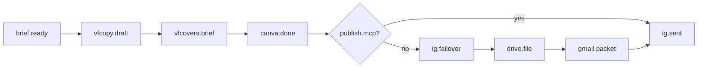

# Scenario: content-live

Huginn pattern: trigger → transform → publish (with failover webhook).  
Crew: [`../crews/content.md`](../crews/content.md)

## Graph

## Events (checkpoint)

| Step | event | payload keys |
|---|---|---|
| 1 | `brief.ready` | `jobId`, `format`: post \| story \| carousel |
| 2 | `vfcopy.draft` | `captionPath`, `cta`: WhatsApp pickup |
| 3 | `canva.done` | `editUrl` or `renderPath` |
| 4 | `ig.sent` | `published`: bool, `tags[]` |
| 5 | `ig.failover` | `canva`, `driveId`, `gmailSent` |

## Send law

- CTA: WhatsApp `050-2517000` / איסוף שדרות. Not «שלחו DM».
- `#נשלח-מ-HQ` when a tool sent.
- `#ממתין-ל-כלי-IG` if feed did not publish via MCP.
- Never claim posted without publish tool or honest failover packet (`vfigos/SEND.md`).

## Verify

- Canva link is real or failover path on disk — not invented.
- No invented Insights on the graphic.

## Outcomes

- `worker_done` — draft + send path completed (posted or failover packet).
- `escalation` — Canva + render.py + Superdesign all failed; Gmail packet still sent if possible.
- `decision_gate` — boost or ₪ promo (lead only).
