# Scenario: content-live

Existing office orchestrator pattern only — no second runtime. Crew: [`../crews/content.md`](../crews/content.md). Creative control: `packages/vfom/CREATIVE-AUTOPILOT.md`. Instagram decision policy: `packages/vfom/INSTAGRAM-CONTENT-DECISION.json`.

## Graph

```mermaid
flowchart LR
  P[real opportunity / print.done / media.verified] --> M[content matrix: cheap evidence-bound candidates]
  M --> S[saturation scan + anti-generic]
  S --> F[format selection]
  F --> H[hook tournament: text + visual + motion]
  H --> A[creative.plan]
  A --> G{critical media present?}
  G -->|no| SR[shotRequest / waiting_for_media]
  G -->|yes| EDL[edit.plan]
  EDL --> R[retention + authority/voice + engagement]
  R --> C[cover + final copy]
  C --> VQ[Visual QA: mobile readability/crop/safe zones/Hebrew]
  VQ --> QA[Visual OS + Rubric + policy + PREFLIGHT + final quality gate]
  QA -->|fail quality| FIX[auto-fix]
  FIX --> VQ
  QA -->|pass| AU{standing authorization?}
  AU -->|yes| AP[authorized_for_tool_publish]
  AU -->|no| HA[pending human authorization]
  AP --> PUB[vfigos publish tool]
  HA --> PUB
  PUB --> V{receipt + live evidence?}
  V -->|yes| DONE[published_verified]
  V -->|no| D[Degraded + failover packet]
  DONE --> L[measured performance feedback -> vfinsights + office-learning]
```

## Laws

- Content matrix expands candidates from 3–5 Velvet-specific pillars and current SocialResearchPacket evidence; every candidate needs proof/source refs, and the stage has no publish authority.
- Saturation claims require evidence. If current external evidence is unavailable, record unknown rather than inventing patterns.
- Generic/template/“look what we printed” content is repaired or archived before render.
- One primary format is selected because it best carries the proof/story; do not generate every format by default.
- Hook tournament evaluates text + visual + motion, not caption text alone, and forbids clickbait.
- Retention, authority/voice and natural engagement passes are mandatory before final QA; engagement bait is forbidden.
- Visual QA is critical and includes contrast, readability, crop, safe zones, hierarchy, branding, product visibility, Hebrew typography and mobile preview.
- Final quality gate is fail-closed and may reject publication. Missing pass evidence is a failure.
- Missing physical media = one precise shot request; no invented bed/product scene.
- Routine hook/cover/cut/caption choices are autonomous.
- Quality failure loops internally; it does not become an owner task.
- Standing authorization is instance-scoped and never covers ₪, Boost/Ads, auto-DM, customer WhatsApp, Print, unclear rights or private customer/CAD material.
- Feed cadence remains `vfgrowth/CALENDAR.md`; no invented schedule.
- No publish claim without tool receipt and verification evidence.
- Post-publish learning uses measured evidence only and writes to existing `vfinsights` + office-learning.

## Outcomes

- `published_verified` — tool receipt + live evidence.
- `performance_learned` — measured post-publish evidence has been ingested.
- `ready_for_publish` — gates pass but publish tool unavailable; failover packet exists.
- `waiting_for_media` — exact shotRequest exists.
- `human_required` — named constitutional/business gate only.
