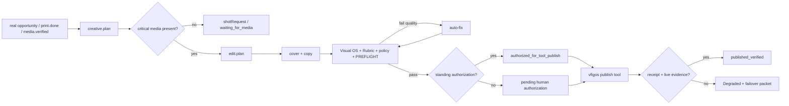

# Scenario: content-live

Existing office orchestrator pattern only — no second runtime. Crew: [`../crews/content.md`](../crews/content.md). Creative control: `packages/vfom/CREATIVE-AUTOPILOT.md`.

## Graph

## Laws

- Missing physical media = one precise shot request; no invented bed/product scene.
- Routine hook/cover/cut/caption choices are autonomous.
- Quality failure loops internally; it does not become an owner task.
- Standing authorization is instance-scoped and never covers ₪, Boost/Ads, auto-DM, customer WhatsApp, Print, unclear rights or private customer/CAD material.
- Feed cadence remains `vfgrowth/CALENDAR.md`; no invented schedule.
- No publish claim without tool receipt and verification evidence.

## Outcomes

- `published_verified` — tool receipt + live evidence.
- `ready_for_publish` — gates pass but publish tool unavailable; failover packet exists.
- `waiting_for_media` — exact shotRequest exists.
- `human_required` — named constitutional/business gate only.
