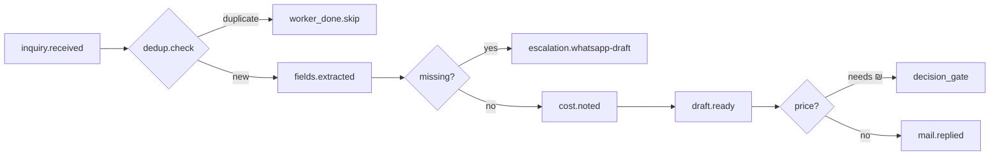

# Scenario: inquiry-chain

Huginn pattern: EmailAgent → transform → DeDuplicationAgent → action.  
Crew: [`../crews/inquiry.md`](../crews/inquiry.md)

## Graph

## Events (checkpoint)

| Step | event | payload keys |
|---|---|---|
| 1 | `inquiry.received` | `threadId`, `jobName`, `receivedAt` |
| 2 | `dedup.check` | `priorCheckpoint`, `duplicate`: bool |
| 3 | `fields.extracted` | `material`, `qty`, `when`, `finish`, `missing[]` |
| 4 | `draft.ready` | `path`, `channel`: gmail \| whatsapp-draft |
| 5 | `mail.replied` | `threadId`, `sent`: true |

## DeDuplication (Huginn)

Before `mail.replied`:

1. Search `vfharness/state/` for same `threadId` or `jobName` with `inquiry.received` in last 7 days.
2. Search `vfops/BRIEF*.md` block `02` for same subject line.
3. If duplicate → `worker_done` with note «כפילות — לא נשלח שוב». Playbook: `vfconvert/hq/DEDUP.md`.

## Verify

- `אימות`: thread actually read; four fields cited or marked missing.
- No invented ₪. WhatsApp stays human (`050-2517000`).

## Outcomes

- `worker_done` — draft path + Gmail `reply` **or** dedup skip documented.
- `escalation` — missing field; WhatsApp question drafted, not sent.
- `decision_gate` — sale ₪ for lead only.
