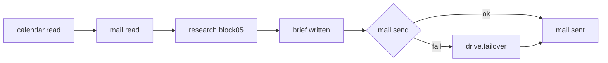

# Scenario: morning-digest

Huginn pattern: DigestAgent + Schedule (`7am` Asia/Jerusalem).  
Crew: [`../crews/morning-brief.md`](../crews/morning-brief.md)

## Graph

## Events (checkpoint)

| Step | event | payload keys |
|---|---|---|
| 1 | `calendar.read` | `date`, `blocks[]`, `clashes[]` |
| 2 | `mail.read` | `subjects[]`, `flags{invoice,inquiry,ig}` |
| 3 | `research.block05` | `source`: `vfops/data/research.md` |
| 4 | `brief.written` | `path`: `vfops/BRIEF-YYYY-MM-DD.md` |
| 5 | `mail.sent` | `to`, `htmlBody`: true |

## Digest rule (Huginn)

Block `05`: if all upstream = «ללא שינוי» → prose is exactly **«אין חדש במשרד»**.

## Verify (`working?`)

- `אימות`: Gmail subjects + Calendar blocks actually read.
- Sensor: `check-staleness.py` — today's `BRIEF-*.md` or `hq/brief-*.json` exists.

## Outcomes

- `worker_done` — brief on disk + mail sent or Drive failover.
- `escalation` — cannot read mail/calendar; block 05 still written honestly.
- `decision_gate` — ₪ row only (not this scenario).
