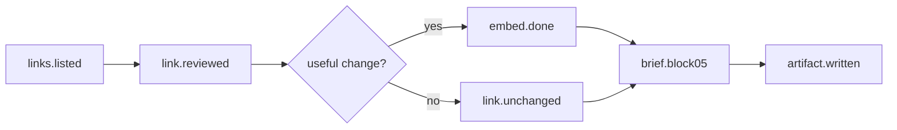

# Scenario: weekly-links

Huginn pattern: WebsiteAgent + Schedule (`weekly`) — **no live daemon**.  
Crew: [`../crews/research.md`](../crews/research.md) + `vfresearch/WEEKLY.md`

## Graph

## Events (checkpoint)

| Step | event | payload keys |
|---|---|---|
| 1 | `links.listed` | `count`, `registry`: `LINKS.json` |
| 2 | `link.reviewed` | `id`, `status`: embed \| unchanged \| skipped |
| 3 | `embed.done` | `pack`, `files[]` |
| 4 | `brief.block05` | `prose` — embed summary or «אין חדש במשרד» |
| 5 | `artifact.written` | `path`: `vfresearch/sources/YYYY-MM-DD-weekly-links.md` |

## Rules

- Re-read each URL in `LINKS.json` top to bottom.
- Wall / private session → «דולג — חומה». No invented body.
- Embed onto **existing pack only** — no new pack per idea.
- After catalog change: `python3 scripts/check-all.py`.

## Verify (`working?`)

- Every link row has `lastReviewed` updated today or «ללא שינוי» noted.
- Sensor: `check-staleness.py` — no link `lastReviewed` older than 8 days.

## Outcomes

- `worker_done` — weekly artifact + block 05 text + `lastReviewed` dates.
- `escalation` — auth wall on all research desks; artifact says what was skipped.
- `decision_gate` — not used.
